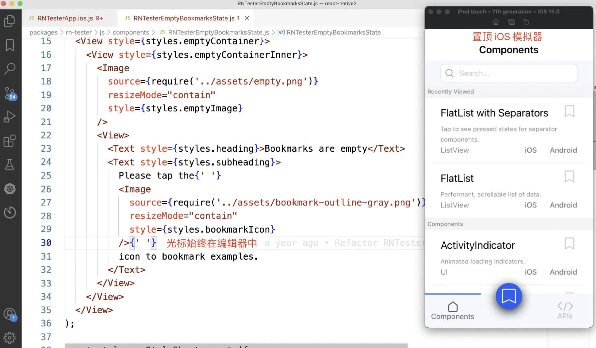
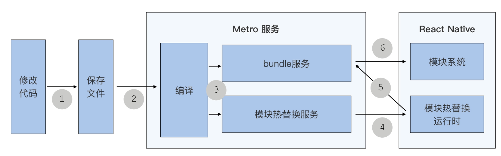
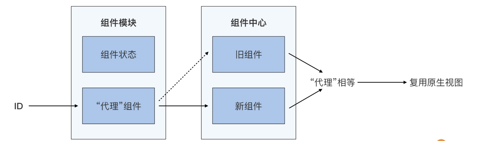
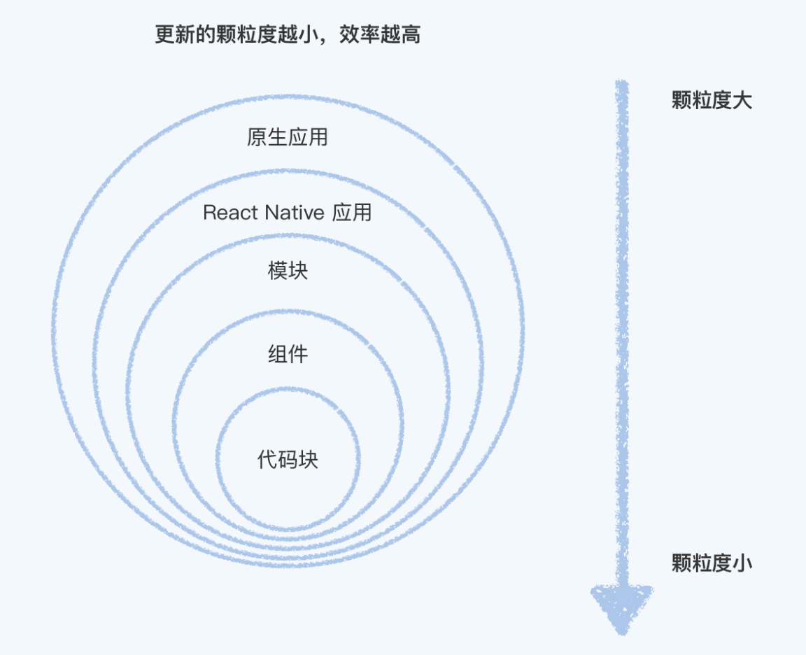
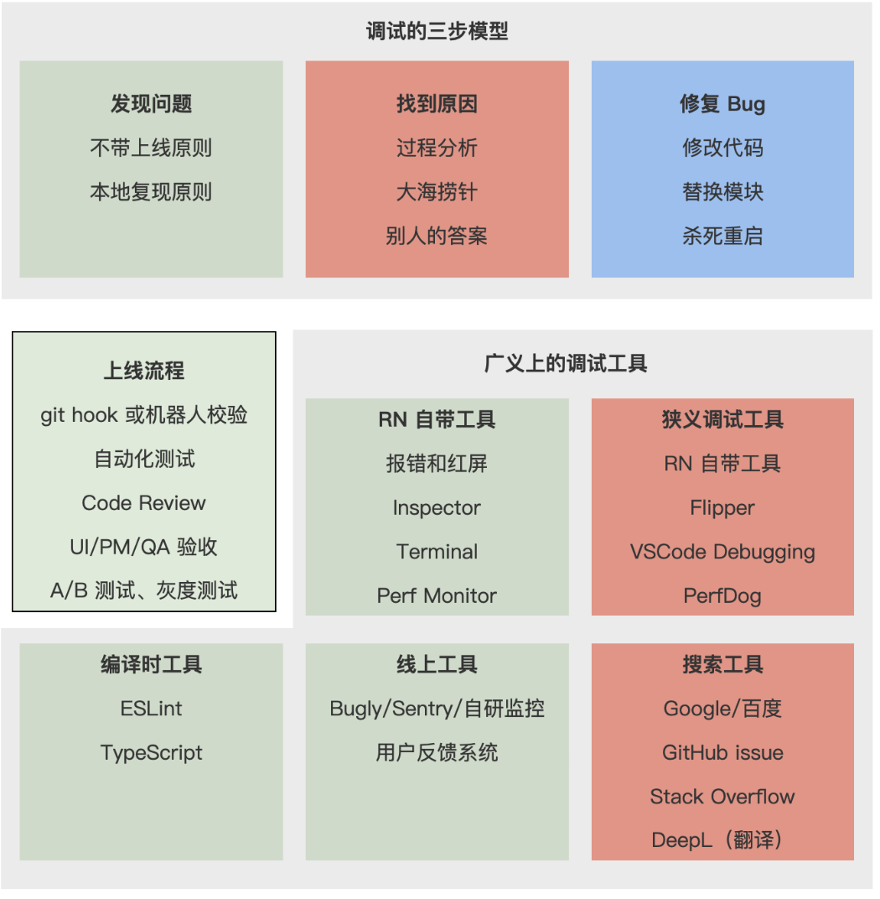
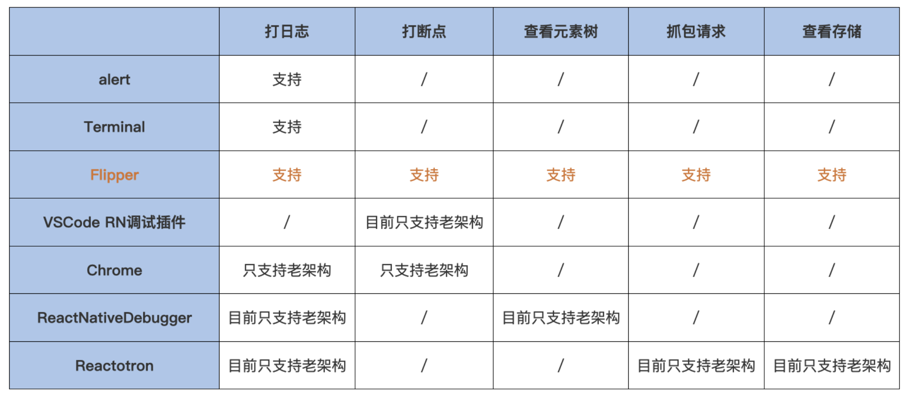

+++
date = '2025-12-15T09:56:10+08:00'
draft = true
title = 'RN基础之叁'
readingTime = true
description = '记录自己学习RN的基础组件'
categories = [
    "跨端",
    "RN",
]
tags = [
    "RN",
]
image="RN基础.png"
+++
# React Native 核心基础篇 叁

>   本篇博客搬运 **极客时间 蒋宏伟 老师的课程** [原文点我](https://time.geekbang.org/column/intro/100110101?code=FAqHFVRUur%25252FgAP-yJQWitk9ieF80imRky3PVsIs%25252FX6A%25253D&tab=catalog) 侵权联系网站博主删除。

## 09｜Fast Refresh：提高UI调试效率神器

在开发 UI 时，大家一般都是一边看设计稿，一边写代码，一边调试，三种行为交替进行的。谁的大脑都不是一台编译机，也不能安装真正的 React Native 环境。即使已经思考得很完备了，我们也不能保写完的一段代码里面没有任何 Bug，每次写完的代码都能完美符合我们预期的设计。所以，我们离不开 UI 调试。

那 UI 调试效率重要吗？非常重要。你可以回想一下，是不是我们大部分的业务开发都会涉及到 UI 的开发。而在 UI 开发的过程中，你是不是会花费很多时间在调试代码上，甚至调试时间可能比真正写代码的时间还要多？正是如此，我们才更应该花点时间学一下调试技巧，把 UI 开发整体效率给提上去。

今天这节课，我会先从 React Native 快速刷新的使用讲起，然后再深入核心原理，帮你理解如何更好地使用快速刷新，提高你的 UI 开发效率。

### 使用快速刷新

React Native [快速刷新（Fast Refresh）](https://reactnative.dev/blog/2019/09/18/version-0.61#fast-refresh)是默认开启的，你不用做任何额外的配置，就能立刻体验到。

快速刷新提效的本质是**及时反馈**。也就是说，你写下代码后就能看到 UI，没有其他任何多余步骤。代码完成了，UI 就更新了，这就是及时反馈。

假设，你正在开发一个商品列表页面。UI 稿中图片左边距为 30px ，你在 Image 的样式中增加了一行 marginLeft: 30 的代码。当你按下快捷键cmd + s保存代码时，不到 1s 的时间，你就看到你屏幕右侧模拟器中，所有商品图片都移到正确的位置上了。

你能在心中快速验证一下，是对的，然后你又添加一行上下居中的代码，又是不到 1s 的时间，商品图片又位移了一下。嗯，完美居中。每一次的 UI 调试都是，所码即所见，无与伦比的开发体验，让你沉浸在这开发的心流中。

这实际上就是我日常使用 React Native 快速刷新能力开发 UI 界面的感受。

在使用快速刷新时，你应该知道一个提升开发效率的小技巧。我日常开发时习惯把模拟器放在代码编辑器右边，并且会把模拟器勾选`window => stay on top`选项，在把模拟器置顶在编辑器上方。

这样，我们就能在写代码和调试的同时，立刻看到模拟器中的效果。相比真机调试或者多屏来回切换，置顶模拟器可以减少手离开键盘和视野来回切换的次数，提高你的开发效率。



看到这里，你是不是很好奇，快速刷新带来的“所码即所见”能力的原理究竟是什么样的？

### 基础原理：模块热替换

React Native 的快速刷新功能的最早期版本，叫做热重载 Hot Reload，是基于 Webpack 的模块热替换[（Hot Module Replacement）](https://webpack.js.org/guides/hot-module-replacement/)的原理开发的。我们写 React Native 之前，都会运行一个 `react-native start `命令，启动一个 Metro 服务，而 Metro 服务就实现了模块热替换的功能。

Metro 服务会把更新的代码打包发送给 React Native 应用，让应用能够及时更新，那这个过程大概是怎么样的呢？

首先，Metro 服务会监听代码文件的变化，当你修改完代码（①），保存文件时（②），Metro 服务就会收到通知。在你保存好后，Metro 就会编译涉及到的更新文件（③），编译完成后再生成一个用于更新的 bundle。

而 Metro 的模块热替换服务和 React Native 应用中的模块热替换客户端（HMR Client），在启动时其实已经建立好了 socket 连接。

所以，当新 bundle 生成时，模块热替换服务会通过 socket 通知块热替换客户端，热替换客户端实际就是运行在 React Native 应用中的一段 JavaScript 代码，它一开始就执行了一个 socket 监听事件（④）。

React Native 收到通知后，就会向请求 bundle 服务发起请求。然后，bundle 服务会返回一个用于更新的 bundle（⑤），并使用 JavaScript 引擎，在原来 React Native 应用的 JavaScript 上下文中执行用于更新的 bundle。

这个 bundle 是由多个模块组成的，你修改代码文件对应的模块及其依赖模块都是新模块，新模块会把原先的旧模块替换掉。⑥这就是整个模块热替换的全部过程，这里我放了一张流程图，你可以参考一下：



但是这里会有一个问题，仅仅只是用新模块替换旧模块，会导致原生视图重新渲染，并且丢失原有状态。

这是因为，新模块的重新执行就意味着，每个新模块中的组件，无论是类组件或者函数组件，都会被重新创建。而 React 在判断是否要更新的时候，会判断更新前后的两个组件是否相等。这样一来，即便新旧组件的代码完全一样，React 也会认为你销毁了原有组件，又创建了一个新的组件。而组件所对应的原生视图，也会发生销毁和重建。

这就好比，你先创建了一个旧的空对象，然后又创建了一个新的空对象。虽然代码完全一样，都是空对象，但是你用全等去判断时，因为对象是引用类型，创建了一个新对象就创建了一个新的引用，新的引用又不等于旧的引用，所以新对象是不等于旧对象的：

```jsx
// 新的空对象 ≠ 旧的空对象
{} !== {}
```

同理，当你保存 List 组件时，即便你没有对 List 组件中的代码做任何修改，模块热替换后，React 也会认为，你保存之前的是旧组件，保存之后的是新组件。而新组件不等于旧组件，那它就会帮你销毁旧的原生视图，并重新创建新的原生视图。这个时候，原有组件状态 state 和原生列表的滚动位置都会丢失：

```jsx
// 保存前：oldList.js
export default function List {}
// 保存后：newList.js
export default function List {}
// 渲染的都是 List 组件
render(){ <List /> }
// 但是，因为 newList ≠ oldList
require('newList').default !== require('oldList').default
// 所以，React 会销毁旧的 List 原生视图，创建新的 List 原生视图
```

也就是说，基础的模块热替换功能只能实现组件级别的强制刷新，而组件状态的丢失，会导致开发效率的降低。

你想啊，当你要在商品列表页面中开发一个弹窗时，你修改了弹窗组件，一保存，弹窗组件强制刷新了，然后就消失了。你要又点开弹窗，重来一次。弹窗还稍微好点，如果是层级更新的组件，你要多次操作才能使用，如此反复操作，开发效率会变得很低。

### 进阶能力：复用组件及其状态

那么，React Native 的快速刷新功能，是如何实现组件状态不丢失，原生视图不重建的呢？

快速刷新功能复用组件和状态的原理分为两个步骤：

1.   在编译时，修改组件的注册方式；
2.   在运行时，用“代理”的方式管理新旧组件的切换。

在编译时， 快速刷新的 babel 插件 [ReactFreshBabelPlugin](https://github.com/facebook/react/blob/v17.0.2/packages/react-refresh/src/ReactFreshBabelPlugin.js) 修改你的代码，将你的组件转换成可被代理的组件。快速刷新 babel 插件和其他 babel 插件一样，它的功能都是对代码进行转换。正如你使用 babel 可以把 JSX 转换为 JavaScript 一样，快速刷新 babel 插件也可以在你组件源代码中插入一些代码，实现组件的“代理”。

打一个比方，如果我们要对一个自定义的 Counter 函数组件实现代理。那我们要怎么做呢？首先，在 metro 打包时，快速刷新 babel 插件，找到文件中要导出的 Counter 组件；然后，通过它的函数名、文件名生成一个全局唯一的 ID，例如 ‘Counter.js#Counter’ ；最后，生成一行注册代码。这行代码的作用是，将 ID 作为一个不变的对象标识，用这个不变的对象去“代理”，因模块热替换而变化 Counter 组件，具体你可以看下这里：

```jsx
// 源代码
export function Counter() {
  const [count, setCount] = useState(0);
  const handlePress = () => setCount(count + 1)
  return <Text onPress={handlePress}>times:{count}</Text>
}

const __exports_default = Counter
export default __exports_default

// 由快速刷新 babel 生成
// 将组件注册到组件管理中心
register('Counter.js#Counter', Counter)
```

有了编译时插入的注册代码，在运行时，我们就可以用“代理”的方式，管理新旧组件的切换了。

无论是初次加载的 Count 组件，还是后续模块热替换不断新建的 Counter 组件，都会放在组件注册中心。而“代理”只会在 Count 组件初次加载时创建，创建之后就作为一个不变的对象放在“代理”注册中心。

在代码保存后，模块热替换会将新的组件代码运行，在新组件被创建的同时，新组件的注册函数就会被执行了。通过唯一的 ID，找到对应的不变“代理”，并将代理的 current 引用，切换到新组件上，完成新旧组件的切换。

```jsx
// ReactFreshRuntime.js
// “代理”注册中心
const allFamiliesByID = {}

// 组件注册中心
const allFamiliesByType = {}

function register(id, componentType) {
    let family = allFamiliesByID[id];

    if (family === undefined) {
      family = {current: componentType};
      // 将不变的“代理”放入“代理”注册中心
      allFamiliesByID[id] = family
    } else {
      // 用不变的“代理”，管理新旧组件的切换
      const prevType = family.current;
      family.current = componentType;
    }
    // 将所有组件都放入组件注册中心
    allFamiliesByType[componentType] = family;
}
```

这就在保证组件不变的情况下，完成了新旧组件的切换。

因为代理组件是存在全局对象上的，所以当你保存代码引起模块系统更新时，代理组件的引用也不会发生改变。接着，页面开始更新，此时调用的是代理组件的 render 方法，然后代理组件调用的更新后的新模块组件的 render 方法。你每保存一次代码，模块系统都更新一次，代理组件实际 render 也会进行一次切换，但是只要你的代码没有变化，React 也不会重新创建原生视图。React Native 组件级别的快速刷新，就是通过**代理组件**实现的。

那究竟是如何实现复用组件及其状态的呢？

我们先来说状态复用。在我们前面的示例中，我们把 Counter 函数组件，放在了 Counter.js 的文件中，一个文件就是一个模块，如果里面只有一个函数组件的话，我们就可以把它叫做一个函数组件模块。模块代码是执行在该模块的上下文中的，上下文中有着各种变量，其中就包括状态。通过“代理”组件的方式，就可以实现在同一个组件模块的上下文中，执行不同的函数组件。无论是新函数组件，还是旧函数组件，用的都是相同的状态，这就是状态复用。

那么组件所代表的原始视图的复用又指的是什么呢？

我们同样打个比方，假设现在你改动的组件要开始渲染 render 了。我们前面提到过，render 时判断是否要重新创建原生视图，是通过浅对比算法 shallowCompare 实现的。如果新旧组件的类型相等就走 re-update 的逻辑不创建，如果新旧组件的类型相等就走 re-mount 的逻辑重新创建。现在，新旧组件的“代理”是就是同一个对象，状态也不会发生改变，浅对比算法判断肯定相等，所以原生视图不会重新创建，从而实现了原生视图的复用。

**简而言之，React Native 的快速刷新功能，就是通过“代理”组件的方式，实现了组件状态不丢失，原生视图不重建。**

这里我放了快速刷新 babel 编译后的复用模型，可以帮助你理解复用的实现原理：



**当然，并不是所有情况都会复用状态和原生视图。**

这又从何说起呢？我从组件类型的角度来给你解释。组件有两种类型：函数组件和类组件。

对于函数组件来说，hooks 的顺序非常重要，相同的状态下，不同的顺序会有不同的结果。如果你修改了 hooks 的顺序，快速刷新时就会重新初始化状态。在其他情况下，函数组件的快速刷新都会为你保留状态

。对于类组件来说，只要是类组件的代码发生更新，组件的内部状态都要重新初始化。关于这点，快速刷新功能的作者 Dan 在博客中解释到，“（保留类组件的状态）热重载是非常不可靠的，最大原因就是类组件的方法是可以被动态替换的。是的，在实例原型链上替换它们很简单，但是根据我的经验，有太多边缘情况了，它根本没有办法可靠地工作”。

>   [The simple answer is “replace them on the prototype” but even with Proxies, in my experience there are too many gnarly edge cases for this to work reliably.](https://overreacted.io/my-wishlist-for-hot-reloading/)

所以，我给你的建议是，尽可能地**拥抱函数组件，放弃类组件**。这样你在 UI 调试的时候，就能更多的享受函数组件带来的状态保留好处。特别是一些入口很深的组件，需要多次操作后才能调试，一旦导航、蒙层、滚动之类的组件状态丢失了，整个操作就要重新再来一遍，才能重新进行调试。拥抱函数组件，你的调试效率才会更高。

当然，如果项目中已经用到了很多类组件，又要调试一些入口很深的组件，怎么办？方法也很简单，你应该把你要调试的组件，单独拎出来调试。如果拎出来的组件和其他组件有依赖关系，也可以通过 mock 数据的形式对其依赖进行解耦，实现快速调试。

想象你已经理解快速刷新的基本原理，接下来我们会站在一个更高的视角，看一下快速刷新的完整策略。

### 整体策略：逐步降级

在编程调试时，有各式各样的代码，有函数组件、类组件、工具函数和常量等等。那么，是什么样的策略，能让你尽可能地快看到调试结果呢？

快速刷新的整体策略就是**逐步降级**。如果颗粒度最小的更新不能使用，就换成颗粒度大一些的更新：

-   代码块：如果你只修改了函数组件中的一些代码块，并且没有改动 hooks 的顺序。快速刷新在复用状态和原生视图的同时，你对该文件的所有修改都会生效，包括样式、渲染逻辑、事件处理、甚至一些副作用；
-   组件：如果你修改了类组件中的任意代码，快速刷新会使用新的类组件进行重新渲染，原来的状态和原生视图都会被销毁；
-   模块：如果你修改的模块导出的东西不只是 React 组件，快速刷新将重新执行该模块以及所有依赖它的模块；
-   React Native 应用：如果你修改的文件被 React 组件树之外的模块引用了，快速刷新将重新渲染整个 React Native 应用。

可以看到，快速刷新的逐步降级策略是，**从更新颗粒度最小代码块开始的，然后是组件、模块，最后是大颗粒度的 React Native 应用**。越小颗粒度的更新，为我们保留了越多原来的状态和环境，我们的开发调试效率也更高。



在调试的过程中，还会有奇奇怪怪的报错发生，比如语法错误、运行时错误和错误边界，这些错误快速刷新都帮你捕获到了。因此，快速刷新还有很强的鲁棒性。

### 总结

现在，再回到我们最初的话题，如何提高 UI 调试效率？我相信现在你已经有了答案。调试 UI 最重要的是及时反馈和所码即所见。React Native 的快速刷新能力，会把我们的代码修改，尽可能快地展示出来。

能够实现快速刷新原因是，快速刷新能够通过模块热替换的方式，用我们修改后的新模块替换原来的旧模块。如果，该模块导出的是组件，那么“代理”组件就会将引用从旧组件切到新组件上，实现组件级别的刷新。如果，函数组件且 hooks 顺序没有发生改变，快速刷新时原有的组件状态也会保留。快速刷新时，越小颗粒度的更新，速度越快，调试效率更高。

要用好快速刷新功能，还有三个小技巧：

1.   同屏预览。将模拟器置顶在编辑器上方，减少你视野来回切换频率；
2.   拥抱函数组件。函数组件能保留原有组件状态，减少你操作交互的次数；
3.   单独拎出来调试。单独拎出来先开发独立组件再集成，可能会比在层层嵌套的代码结构中开发效率更高。

## 10｜Debug：解决BUG思路有哪些？

传说中，比尔盖茨在飞机上顺手撸一个 BASIC 解释器，不 Debug 就能直接跑起来。虽然比尔盖茨是“传说级”的程序员，但他写代码也是需要调试的。我们可以在维基百科的 Altair BASIC 词条看到：

>   盖茨和艾伦从波士顿的分时租赁服务中购买了电脑上机时间来完成 BASIC 程序的调试。

但现实中，我们大部分情况都很难做到不 Debug，不调试就能把代码顺利上线，更多情况下，我们都需要和 Bug 做一番搏斗。

从搭建环境时 Gitlab 拉下来的代码跑不起来，到开发过程修改一段代码逻辑总是报错，再到产品上线后也时不时地有产品、测试、老板找过来反馈线上问题。无论是已经存在的、还是潜在的 Bug，这些都需要我们去发现和解决。不是有调侃的话么？我们程序员“不是在解决 Bug 的路上，就是在写 Bug 的路上”。

这话虽然只是一句调侃，但是这也侧面印证了两点：一方面是，我们会遇到很多 Bug，也会花很多时间去解决 Bug；另一方面是，我们直接裸写的代码可能存在较多的潜藏 Bug，我们得花精力把这些潜藏的 Bug 给找出来。那面对这些 Bug，有没有什么通用的解决思路呢？

这正是今天我要和你介绍的，我把它概括为“1+2+3”，也就是一个模型，两个原则，三条思路。

### 一个模型：发现问题、找到原因、修复 Bug

那么，一个模型是什么呢？

一个模型指的是，**发现问题、找到原因、修复 Bug** 的三步模型。其实这就是我们日常解决 Bug 的常规步骤，我只不过把它划分归类了一下，接着你就会看到划分的好处了。

虽然我们遇到的 Bug 形形色色、各不相同，但当你把解决问题划分为三步之后，我们就可以针对不同的步骤给出不同的解题思路了。每个 Bug 都有每个 Bug 修复的思路，但大部分的 Bug 在发现问题和找到原因这两步，是可以找到一些通用方法的。而我接下来要讲的“两个原则”，说的就是发现问题这一步的两个原则，“三条思路”说的就是找到原因这一步的三个思路，这些原则和思路都是通用的。

在发现问题和找到原因这两步中，我们也离不开团队成员的相互协作，以及各种调试工具支持。因此，在讲原则和思路的过程中，我也会和你介绍流程该怎么走，工具该怎么用。

另外，这里还需要你注意，狭义和广义调试是有所不同的。狭义的调试，指的是代码运行时打日志、打断点；但广义的调试，指的是发现问题和解决问题的过程（Debugging is the process of finding and resolving bug）。

任何能够帮助我们发现和解决问题的工具，都可以归类为广义的调试工具，甚至上线流程也是可以为调试服务的。当你把视野打开之后，思路也变广一些，这可以让你可以更快地、更容易地发现问题和解决问题。

我给你画了一张调试的全貌示意图，把调试的三步模型、上线流程和广义上的调试工具都画上去了。你先停下来看一下，接下来我也会进行更详细的介绍。



### 两个原则：不带上线原则和本地复现原则

我先和你介绍发现问题这一步的两个原则：**不带上线原则和本地复现原则。**

1.   不带上线原则：要尽可能早地在本地开发时发现问题，提前发现问题是不带 Bug 上线的必要条件；
2.   本地复现原则：如果 Bug 已经被带上线了，我们要尽快发现它，还要尽可能多地收集线上信息，让它能更容易地在自己的手机或本地复现。

不带上线原则怎么实践呢？首先，我们要清楚，没有任何的线上 Bug 是不可能的，但我们可以减少带上线的风险，比如团队成员之间可以通过合作建立一套完善的上线流程，依靠流程和机制来减少风险。其次，在这套流程和机制下，我们自己可以选择合适的工具来减少风险。

那么，一个理想的上线流程和配套工具是什么样的呢？我认为 GitHub 社区其实已经为我们提供了一种答案。

GitHub 社区中那些流行的仓库都有一套完整的上线流程，比如 React、React Native 仓库，一般都有**自动化的本地校验和线上校验，还有项目成员的 Code Review**。这套流程经历了上千人的校验，我认为是非常有学习和实践价值的。

在本地开发时，需要针对开发的新增的模块写一个新的单元测试。在提交代码的时候，有 git hook 的自动脚本来执行我们的 Jest 单元测试，并校验 TypeScript、ESLint 是否通过，只有校验通过之后才能提交。在提交到远程仓库后，还有机器人再校验一次，并且只有在机器人校验和项目成员的 Code Review 通过后才能把代码合到主分支。

而理想上线流程的另一套答案，其实也是大部分团队都在实践的答案。当我们把新功能推到的代码仓库的主分支中，我们还需要把主分支中的代码进行上线。在上线过程中，我们需要靠 UI 验收、靠 QA 测试、靠 PM 体验，靠团队的力量来尽早发现 Bug。必要的时候，还可以在上线平台上下功夫，比如只有 QA 拥有上线权限，又比如做 A/B 测试、灰度测试等。

但即便如此，也难免会将一些本地 Bug 带上线，因此我们还需要快速发现线上 Bug。大部分时候，那些线上的、偶现的、没有报错信息的 Bug，比本地的、必现的、有报错信息的 Bug，更加缺乏有效信息，也更难发现。对于线上 Bug 而言，**快速发现线上 Bug 关键是对线上数据的收集，并通过收集的数据来进行分析，使其能在本地复现。**线上 Bug 本地复现之后，剩下的修复思路就和本地 Bug 的修复思路是一样的了。

这个时候，我们有两种工具可以利用，一种是监控系统，另一种是用户反馈系统。

在技术层面接入一套监控系统，比如腾讯出品的常用于原生应用监控的 Bugly，或者开源领域的 Sentry，又或者是自研的监控平台，这些都是可以的。在产品层面上，我们需要有一套用户反馈机制，它们的核心作用是发现那些本地难以复现、又缺乏线上报错数据的 Bug。

实际上，每个团队、每个项目的情况都不一样，你可以根据自己项目的情况进行选择。

### 三条思路：一推理、二分法、三问人

发现问题之后，接着就要寻找问题的原因。寻找问题的原因有哪些思路呢？我有 三条思路供你参考：“一推理”、“二分法”、“三问人”。

所谓的“一推理”，它指的是，我们遇到问题首先要做的是**冷静地思考、分析和推理**，要搞清楚问题是什么，知道问题是什么了，能直接解决的就自己直接解决，不要一开始就去网上搜答案。网上答案很多，但搜索正确答案成本很高，而且别人的答案不一定能解决你的问题。

你不妨先从红屏报错中提炼有用信息，再检查代码逻辑是否有明显错误并得出初步判断，然后打日志、打断点，再重新跑一次代码，验证你的判断。如果遇到的是复杂代码，可以从代码模块的出口入口着手来判断，然后再分析代码内部细节。在分析阶段中，我们也离不开（狭义）调试工具的支持。

-   红屏信息：

    对于那些本地的、必现的、有红屏报错的 Bug 而言，红屏信息有时候能帮你直接指出是你的代码哪里有问题。

即便是那些没有提供具体报错代码的红屏报错，也会提供一些有用信息，只是这些有用信息需要你想一下才能分析出来。有些人在遇到红屏报错时，只是稍微看了一眼红屏信息，并不会去仔细地研究红屏信息内容，就直接动手开始改起代码了。这就相当于，有一份地图你不用，就直接闯起了迷宫。

**当你遇到红屏时，应该先认真读一遍红屏中的报错信息，第一遍没读懂没关系再多读几遍**，英文不熟也不要紧，可以翻译一下，看看有什么关键字，再仔细想一下。很多时候，当你真的这么做了就找到原因了，不用后面那些分析步骤了。

-   **检查逻辑**：

    有时候呢，我们可以根据红屏提供的执行结果，猜出大致的问题范围。这时候呢，你可以先在脑袋里面过一遍代码执行过程，先检查一下自己是不是有拼写错误、API 的使用方法对不对、一些边际条件有没有考虑到等等。检查一遍之后，即便没有找到原因，心里多多少少会有一些判断。

-   **执行代码**：

    在你有这些判断后，你就可以通过打日志、打断点等方式来验证你的判断，找到到底是哪个变量或者是哪段逻辑有问题了。

这里需要和你强调的是，不要一上来毫无头绪就开始打日志、打断点，这样做效率很低。**一定要先检查代码、先判断原因，再去打日志、打断点去验证你的判断，这样你的调试能力、逻辑能力才会慢慢变强，调试速度才能慢慢提高**。

-   **出口入口**：

    有时候代码太复杂了，代码内部执行的步骤太多了，要寻找是具体是哪段逻辑有问题就太难了。这时候，你可以先对代码的入口或出口的数据进行分析。比如，函数组件可能有问题，你可以通过工具查看元素树的结构和具体元素属性；又比如，前后端交互的请求可能有问题，你可以抓包看请求内容；再比如，本地磁盘存储结果有问题，你可以去查看存储结果。

从出口和入口开始分析先得出结论，再打日志、打断点定位问题原因，有时候可能比直接分析复杂代码的内部逻辑得出结论，要更快一些。

-   **分析工具**：

    在分析阶段，必不可少的就是（狭义）调试工具，像打日志、打断点、抓包请求、查看存储这些功能都需要调试工具的支持。我给你画了一张调试工具功能图，涵盖了各类调试工具的支持程度：

    

我们简单分析下这几个工具。首先是弹窗 alert，它的好处是依赖任何环境，但一个弹窗能展示的内容太少了，只有在线上环境我才会用到它。

接着是终端 Terminal，你在本地通过 Terminal 启动打包工具 Metro 的服务时，你的调试代码就和 Terminal 建立了连接，你通过 console.log 打印的日志，都会在 Terminal 显示。使用它时，你不必单独下载其他任何的调试工具。据我所知，很多人排查问题只靠 Terminal 打日志，但实际上还有其他更好用的工具。

比如 Facebook 出品的移动应用调试工具 Flipper 就不错，但你需要单独进行下载。它的功能很强大，打日志、打断点、查看元素树、抓包请求、查看存储它都支持，而且支持扩展插件。

比较流行的调试工具还有 React Native Debugger、Reactotron，如果涉及原生代码，你还可用 Android Studio、Xcode 进行调试。

这些工具你不必每个都要学会怎么使用，选择几个你顺手的即可。工具只是辅助，关键是分析本身，调试工具只要够用就行。我平时用得比较多的是 Terminal 和 Flipper。

看完第一招，我们再来看第二招：“二分法”。

在你遇到不知道是什么原因引起的 Bug 时，你可以试试这招。所谓的“**二分法**”，说的是在我们不能确定问题原因的时候，**把所有潜在的问题都用类似“数组二分查找”的方式把代码遍历一遍**，不断缩小问题的范围，最终找到问题原因。

“二分法”怎么分呢？一个排除疑难杂症的通用思路是这样的，我们的代码是运行在环境中的，代码本身也有多个版本的、同一个版本中代码也是分多个模块的。那我们就可以从环境、版本、模块入手排查。

我们先把环境和代码分开，先排查环境原因，如果别人的电脑、手机都没有问题，我的有问题，那就可以判断是我的电脑、手机的环境有问题，否则就是代码问题。

如果是代码问题，我们再排查上一个上线版本有没有问题，上一次 commit 的代码有没有问题，如果上一次也有问题就是历史遗留问题，否则就是新引入的问题。

如果是新引入的问题，再从根组件开始排查，一个 React Native 应用（或页面）只有一个 Root 组件，一个 Root 组件有若干个子组件，子组件又有自己的子子组件，这就组成了一个组件树，你只要顺着 Root 组件一步一步地进行二分判断，看哪一边的子树是有问题的，哪一边的子树是没有问题的，最终就能确定问题代码的范围了。

“二分法”的思路是从整体到局部，它还有一个变种就是“多分法”。比如首屏性能问题，用户从点击、到请求、再到渲染的过程是一个整体，你可以把这个整体中各个阶段中的关键节点都埋上性能统计埋点，找到那些优化收益率高的、做起来容易的地方去优化。只有从整体的视角出发，分析出每个局部的优化空间有多少，你才能判断各个技术方案的投入产出比（ROI），做出全局最优的决定。

如果前面两招用完，还解决不了问题呢？不用着急，我们还有**第三招：问人**。

**所谓的“三问人”，说的是我们借鉴别人的经验来解决自己的问题，别人可以是同事、朋友、微信群，也可以是搜索引擎。**

搜索引擎相信你也经常用，所以我只和你重点说一下我的使用技巧和经验。

首先，Google 搜到的资料更全一些有博客、论坛、GitHub、学习型网站，百度搜到的大多是国内开发者的博客。另一类就是专业的技术网站，比如 GitHub 和 Stack Overflow，这类专业技术提供的搜索引擎的搜索效率，有时候比 Google 还要更高一些。有时候我在 Google 搜索出的内容不是我想要的，我就会跑到 GitHub 的 React Native 仓库的 Issues 中和 Stack Overflow 上直接搜索，它们推荐的内容就会更加精准一些。

有些英语差的同学可以会觉得，使用 Google、GitHub 这类以英文为主的网站，语言是个门槛。我的建议是你多用翻译引擎，使用工具来打破这个语言门槛。你不着急的时候，英语文章可以一个词地一个词地慢慢看，这也能提升自己的英语水平，但工作中毕竟是以效率优先，我推荐你使用 DeepL 翻译引擎，在 DeepL 的宣传资料中，它的中英互译的准确性比 Google 等翻译引擎要强上 5 倍，我的实际使用感受也确实是准确很多。

### 课程小结

广义上讲，调试就是发现问题和解决问题。那如何调试呢？我有 “一个模型、两个原则、三条思路”和你分享。

-   一个模型：这个模型包括，调试的三个步骤发现问题、找到原因、修复 Bug，还包括配套的广义调试工具、团队上线流程。这个广义的调试模型，相对于狭义上的调试，它的意义在于能帮我们扩宽解决 Bug 的思路；
-   两个原则：这两个原则是不带上线原则和本地复现原则。不带上线原则强调的是，调试不仅仅是解决问题，更是提前发现问题减少线上 Bug；本地复现原则强调的是，解决线上 Bug 的关键是能在本地复现问题，而复现问题很依赖监控系统和反馈系统；
-   三条思路：你可以先用“一推理”，再用“二分法”、最后是“三问人”来解决具体 Bug 。

### 补充材料

**自带工具：**

-   [react-native doctor](https://reactnative.dev/blog/2019/11/18/react-native-doctor)：可以帮忙检查本地环境是否搭建是否有问题。
-   [Perf Monitor](https://reactnative.dev/docs/debugging#performance-monitor)：调试情况下摇一摇手机，就会有一个弹窗，其中 Perf Monitor 功能可以帮你查看本地的 JavaScript FPS 和 Native FPS。
-   [Inspect](https://reactnative.dev/docs/debugging#inspecting-component-instances)：摇一摇中的 Inspect 功能，可以帮我们查看组件树的结构。

**搜索工具：**

-   翻译：DeepL、谷歌翻译 百度翻译。DeepL 还有客户端，配合快捷键使用更方便。
-   搜索：谷歌搜索、百度搜索。
-   专业网站：React Native GitHub Issues、Stack Overflow。
-   AI工具。

**第三方工具：**

-   **（推荐）Facebook 推出的移动应用调试工具Flipper**；
-   （不推荐）微软推出的 VSCode 插件 React Native Tools；
-   （不推荐）Infinitered 推出的 Reactotron；
-   （不推荐）React Native Debugger。


