+++
date = '2025-12-10T17:53:31+08:00'
draft = true
title = 'RN基础之贰'
readingTime = true
description = '记录自己学习RN的基础组件'
categories = [
    "跨端",
    "RN",
]
tags = [
    "Android",
    "RN",
]
image="RN基础.png"
+++
# React Native 核心基础篇 贰

## 06｜Pressable：如何实现一个体验好的点按组件？

点按组件的设计与我们的用户体验息息相关。有人会因为机械键盘的敲击感好，不买百来块的薄膜键盘，而花上贵十倍的价格去买 HHKB、Filco，也有人会因为某个应用的点按体验不好，而转投竞品应用。

如果你仔细观察过世界上那些流行的、口碑很好 App，比如微信，你会看到它们在点按组件的体验的细节上都做得特别好。

比如，微信的点按组件都是有交互反馈的，无论是背景颜色的加深，还是那些舒服的震动，又或者是动画。又比如，微信顶部右上角的加号按钮是很容易点击的，它的点击区域是比显示图标大上那么一丢丢，而且点到后，即使把手指挪开图标的位置再松开也是能触发点击的。

所有的这些设计都是“懂”用户的。担心你因为网络卡、机器卡不知道有没有自己点中，在你点完后给你视觉或触觉上的反馈；担心你走路的时候想点点不到，把事件的“可触发区域”、“可保留区域 ”设置得比视觉上的“可见区域”大上那么一些。

作为直接和用户打交道的工程师，**我们也得“懂”用户**，也得去优化我们负责的 App、页面的体验，**还得在技术上搞懂点按组件使用方法和背后的原理，把这种最常用的人机交互体验给做到及格，做到优秀**。

所以，今天这节课，我会以三个问题为脉络进行讲解：

-   点按组件是要简单易用还是要功能丰富，如何取舍？
-   点按组件是如何知道它是被点击了，还是被长按了？
-   点按组件为什么还要支持用户中途取消点击？

通过这三个问题，你不仅能明白如何在 React Native 中实现一个体验好的点按组件，同时也能借助它背后的设计原理，更“懂”用户，提升产品的用户体验。

### 要简单易用还是功能丰富？

首先，点按组件是设计给你我这样的开发者来使用的，它功能越简单开发者用起来就越简单，它功能越复杂就能满足更多的需求场景。那是让开发者简单易用好，还是用丰富的功能去满足用户，有没有两全其美之计？

实际上，React Native 的点按组件经历了三个版本的迭代，才找到了两全其美的答案。等你了解了这个三个版本的迭代思路后，你就能很好明白优秀通用组件应该如何设计，才能同时在用户体验 UX 和开发者体验 DX 上找到平衡。

我先给你从第一代点按组件开始讲起。

#### 第一代 Touchable 组件

第一代点按组件想要解决的核心问题是，提过多种反馈风格。

一个体验好的点按组件，需要在用户点按后进行实时地反馈，通过视觉变化等形式，告诉用户点到了什么，现在的点击状态又是什么。

但不同的原生平台，有不同的风格，反馈样式也不同。Android 按钮点击后会有涟漪，iOS 按钮点击后会降低透明度或者加深背景色。React Native 是跨平台的，那它应该如何支持多种平台的多种反馈风格呢？

第一代 Touchable 点按组件的设计思路是，提供多种原生平台的反馈风格给开发者自己选择。框架提供了 1 个基类和 4 个扩展类，它们分别是：

-   TouchableWithoutFeedback：用于响应用户的点按操作，但不给出任何点按反馈效果。反馈效果由 4 个扩展类实现；
-   TouchableNativeFeedback：给出当前原生平台的点按反馈效果，在 Android 中是涟漪（ripple）效果，就是从点击处散开水波纹的效果；
-   TouchableOpacity：短暂地改变组件的透明度；
-   TouchableHighlight：短暂地加深组件的背景色；
-   TouchableBounce：有 bounce 回弹动画的响应效果。

Touchable 点按组件提供了 5 个类，选择起来也很麻烦。有经验的开发者可能知道如何进行选择，但新手却要花上很长时间，去了解不同组件之间的区别。所以说，Touchable 点按组件在提供多样性的功能支持的同时，也带来了额外的学习成本。

为了降低学习成本，React Native 团队又开发了第二代点按组件，Button。

#### 第二代 Button 组件

第二代 Button 组件的实质是对**Touchable 组件**的封装。在 Android 上是 TouchableNativeFeedback 组件，在 iOS 上是 TouchableOpacity 组件。

Button 组件的设计思想就是，别让开发者纠结选啥组件了，框架已经选好了，点按反馈的样式就和原生平台的自身风格保持统一就好了。

但我的经验告诉我，要让大多数开发者都选择同一个默认的 UI 样式真是太难了，萝卜白菜各有所爱。另外，用户的审美也在慢慢地变化，涟漪风格也好，降低透明风格也好，背景高亮风格也好，或许几年后就不会再流行了。甚至连 Button 这个概念本身，都在慢慢地变化，现在的 App 中几乎只要是个图片或者文字都能点按，不再局限于只有四四方方的色块才能点按了。

Button 组件虽然降低了开发者选择成本，但是想在 UI 风格上让大家选择都原生平台自身的风格，这太难了。因此，React Native 团队又开发了第三代点按组件 Pressable。

#### 第三代 Pressable 组件

第三代 Pressable 点按组件，不再是 Touchable 组件的封装，而是一个全新重构的点按组件，它的反馈效果可由开发者自行配置。

但是，点按组件通常是有点击和未点击两种状态的，这两种状态对应着两种点按样式，一种样式是未点击时的基础样式，一种是点按后的反馈样式。这两种样式怎么写？又该怎么切换？

Pressable 组件的 API 设计得很是巧妙，扩展起来非常方便。Pressable 的样式 style 属性同时支持固定样式，和函数返回的“动态样式”：

```tsx
type PressableStyle = ViewStyle | (({ pressed: boolean }) => ViewStyle)
```

其一，固定样式，也就是`type PressableStyle = ViewStyle `的意思是，`Pressable` 组件的支持样式类型和 View 组件的支持样式类型是一样的，具体 `ViewStyle` 都包括那些“通用”样式和“私有”样式，我们在《Style》中已经学过了，相信你能很快回想起来。

其二，动态样式，也就是`type PressableStyle = (({ pressed: boolean }) => ViewStyle) `的意思是，在用户没有点击时 `pressed` 值为 false，在用户点击时 `pressed` 值为 true，你可以根据两种点按状态，为按钮定制不同的样式。

具体怎么实现呢？我们先来看固定样式。固定样式，顾名思义，就是按钮组件的样式是“固定”的，比如你可以看下这段代码：

```jsx
// 固定的基础样式
const baseStyle = { width: 50, height: 50, backgroundColor: 'red'}

<Pressable
  onPress={handlePress}
  style={baseStyle} >
  <Text>按钮</Text>
</Pressable>
```

这段示例代码就是一个最简单的固定样式按钮的代码片段。我们在 Pressable 元素中嵌套了一个文字是“按钮”的 Text 元素，并给 Pressable 元素添加了一个固定的基础样式，宽高各位 50 像素，且背景颜色为红色。

那如果我们需要实现动态样式，应该怎么实现呢？比如，你想在所有平台都实现降低透明度的点击反馈，那你可以定义一个基础样式 baseStyle，然后通过点按状态 pressed ，管理透明度 opacity 的切换。具体的代码示例如下：

```jsx
// 固定的基础样式
const baseStyle = { width: 50, height: 50, backgroundColor: 'red'}

<Pressable
  onPress={handlePress}
  style={({ pressed }) => [ /* 动态样式 */
    baseStyle,
    { opacity: pressed ? 0.5 : 1} 
  ]} >
  <Text>按钮</Text>
</Pressable>
```

这段示例代码用的就是 Pressable 的动态样式。首次渲染时，React Native 会先调用一次 Pressable 的 style 属性的回调函数，这时点按状态 pressed 是 false，透明度为 1。在你触碰到“按钮”时，就会触发点击事件 onPress，与此同时，React Native 会再调用一次 style 属性的回调函数，此时点按状态 pressed 是 true，透明度为 0.5。在你松开“按钮”后，透明度会重新变为 1。

你可以看到，使用动态样式来实现降低透明度的点击反馈是非常方便的。除了改变透明度，你还可以选择改变背景色，改变按钮的宽高，甚至还可以把“按钮”的文字改了。你看，动态样式是不是非常灵活？

除了这两点，你可能还会问，如果我想实现 Android 平台特有的涟漪效果，Pressable 组件也能实现吗？可以，你可以使用 android_ripple 和 android_disableSound 属性进行配置。

-   android_ripple：用于配置 Android 特有的涟漪效果;
-   android_disableSound：禁用 Android 系统的点击音效，默认 false 不禁用。

其实，目前这三代点按组件是同时存在于 React Native 的官方组件库中的，那开发时我们该怎么选呢？我认为：

-   第一代点按组件 Touchable，功能丰富但学习成本太高；
-   第二代点按组件 Button，简单易用但带了默认样式和反馈效果，通用性太差；
-   第三代点按组件 Pressable，同时满足了简单易用和复杂效果可扩展的特性。

因此，在实现自定义的业务按钮组件时，我更加推荐你使用第三代点按组件 Pressable。而且，Pressable 组件的动态 style 的设计思路，也是非常值得我们学习的。

### 如何知道是点击，还是长按？

我们再来看第二个问题：点按组件 Pressable 是如何知道它是被点击了，还是被长按了？

整个点按事件的响应过程是硬件和软件相互配合的过程。 Pressable 组件响应的整体流程，是从触摸屏识别物理手势开始，到系统和框架 Native 部分把物理手势转换为 JavaScript 手势事件，再到框架 JavaScript 部分确定响应手势的组件，最后到 Pressable 组件确定是点击还是长按。

你看，一个 App 要识别是点击还是长按，并没有那么容易吧？庆幸的是，这些复杂的识别工作都由手机硬件、操作系统、React Native 框架帮我们实现了。作为开发者，大部分时候我们只需要知道怎么使用和了解基本原理就可以了。今天我们把焦点放在最后一步，Pressable 组件是怎么确定用户是点击还是长按的。

我们知道，开始响应事件和结束响应事件是两个最基础的手势事件，在 Android、iOS 或者 Web 中都有类似的事件。在 React Native 中它们是：

-   `onResponderGrant`：开始响应事件，用户手指接触屏幕，且该手势被当前组件锁定后触发；
-   `onResponderRelease`：结束响应事件，用户手指离开屏幕时触发。

基于开始响应事件 onResponderGrant 和结束响应事件 onResponderRelease，Pressable 组件可以很容易地封装出开始点按事件 onPressIn 和结束点按事件 onPressOut。

你可以在 Pressable 组件中，使用 onPressIn 来响应开始点按事件，使用 onPressOut 来响应结束点按事件。示例代码如下：

```jsx
<Pressable 
  onPressIn={handlePressIn}
  onPressOut={handlePressOut}
  >
  <Text>按钮</Text>
</Pressable>
```

当你触碰到“按钮”开始点按时，React Native 框架就会帮你调用 handlePressIn 处理函数，当你手指离开“按钮”结束点按时，就会调用 handlePressOut 处理函数。

基于开始点按事件 onPressIn 和结束点按事件 onPressOut，我们自己是否可以封装出“自定义”的点击事件 onPress 和长按事件 onLongPress 呢？你可以短暂的按一下暂停键，思考一下如果要要你来实现你会怎么做，然后再去看 React Native 框架提供的答案。

这个方案也很简单，你只需要判断 onPressIn 事件和 onPressOut 事件之间触发间隔耗时就可以了：

-   如果间隔耗时 < 500ms 属于点击。用户的点按动作会先触发 onPressIn，再触发 onPressOut，在 onPressOut 事件中可以触发我们 “自定义的”点击事件 onPress；
-   如果间隔耗时 >= 500ms 属于长按。用户的点按动作会先触发 onPressIn，这个时候你可以埋下一个定时器，并在第 500ms 时通过定时器触发我们 “自定义的” onLongPress，最后在用户松手的时候触发 onPressOut。

实际上，React Native 框架就是这么设计的。

在你同时监听了 onPress 和 onLongPress 两个事件时，如果点按耗时小于 500ms，在你松手时触发的是点击事件 onPress；如果点按耗时大于 500ms，大致会在第 500ms 先触发长按事件 onLongPress，那这时即使你再松手也不会触发 onPress 事件了。也就是说，**点击事件 onPress 和长按事件 onLongPress 是互斥的，触发了一个就不会再触发另一个了**。

关于 Pressable 组件的 4 个响应事件，onPressIn、onPressOut 、onPress 和 onLongPress 的触发方式，我放了一张官方提供的示意图，相信你看后会有更深的理解：

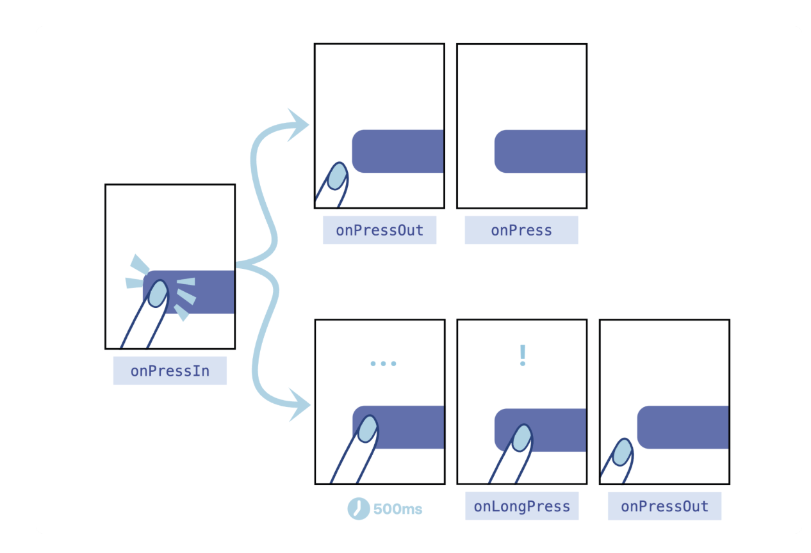

### 为什么支持中途取消？

现在，你对 Pressable 组件的点按事件的工作原理已经有所了解了。讲到这里，我们开头提出的三个问题，只剩最后一个：点按组件为什么还要支持用户中途取消点击？

要讲清楚这个问题，我们需要深入到事件区域模型，也就是点按操作手势的可用范围的概念下进行讲解。

点按操作手势的可用范围包括盒模型区域、可触发区域 HitRect 和可保留区域 PressRect ，接下来我们一个个讲解。

#### 盒模型区域

还记得吗？在我们介绍《Style》的布局属性时，我们有提到过宽度 width、高度 height，这两个属性就决定了盒模型（Box Modal）中的内容 content 大小。除此之外，盒模型中还有内边距 padding、边框 border、外边距 margin。

这些内容、边框、边距之间关系是什么呢？其实，React Native 中的盒模型概念来自于 Web 领域的 W3C 规范，我把规范中的盒模型示意图放在了下面：

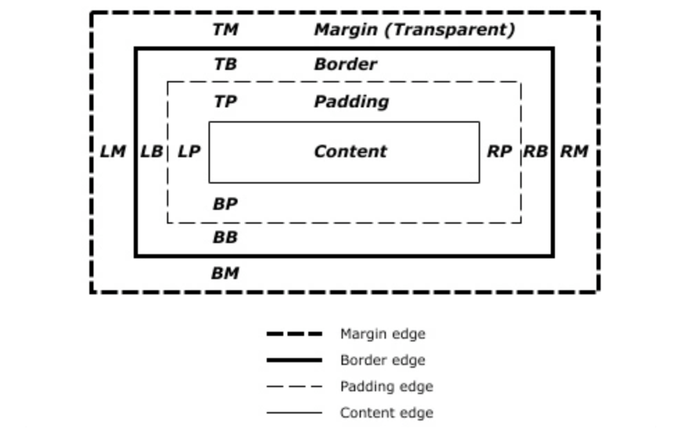

你可以看到，最里面的是内容 Content，然后再是 Padding 和 Border，最外面的才是 Margin。请你注意了，Content、Padding、Border 默认是不透明度的，但 Margin 是天生透明的，并且不可以设置透明度、设置颜色。

你猜，点按事件的默认触发区域是盒模型中的哪几部分？答案就是，盒模型中的默认不透明的部分。这些用户看得见的部分，包括 content、padding 和 border 部分。可以看得见才可以点击，这样的设计是非常合理的。

我给你贴出了点按事件的默认触发区域的测试代码，你也可以自己点一点、试一试，体会一下：

```jsx
<Pressable style={{
    margin: 10,
    borderWidth: 10,
    borderColor: 'red',
    padding: 10,
    width: 100,
    height: 100,
    backgroundColor: 'orange',
  }}>
  <Text>点我</Text>
</Pressable>
```

在上面的示例代码中，我们特意给了 100 像素的宽高，这是很容易点中的，但在日常我们使用 App 时，并不会有这么大按钮。你也许遇到过类似的情景，单手把持手机的时候左上角的返回键老点不中，勾选用户同意事项的时候老勾不中，等等。人的手指并不是什么精密仪器，不能保证任何情况下都能正确地点按到指定区域。那这种情况该怎么处理呢？

我们可以直接修改宽高、边框、内边距的值，通过扩大盒模型的范围，提高点中的成功率。但是，修改盒模型成本较高，它可能会导致原有 UI 布局发生变化。

**更好的方案是，不修改影响布局的盒模型，直接修改可触发区域的范围，提高点中的成功率。**

#### 可触发区域 HitRect

Pressable 组件有一个可触发区域 HitRect，默认情况下，可触发区域 HitRect 就是盒模型中的不透明的可见区域。你可以通过修改 hitSlop 的值，直接扩大可触发区域。

HitSlop 类型的定义如下：

```tsx
type Rect = {
    top?: number;
    bottom?: number;
    left?: number;
    right?: number;
}

type HitSlop = Rect | number
```

HitSlop 接收两种类型的参数，一种是 number 类型，以原有盒模型中的 border 为边界，将可触发区域向外扩大一段距离。另一种是 Rect 类型，你可以更加精准地定义，要扩大的上下左右的距离。

在老点不中、老勾不中的场景中，你可以在不改变布局的前提下，设置 Pressable 组件的可触发区域 HitSlop，让可点击区域多个 10 像素、20 像素，让用户的更容易点中。

#### 可保留区域 PressRect

前面我讲到，用户的手势可能会有一定误差。不仅如此，用户的行为本身就很复杂，用户的意愿也可能会在很短的时间内发生改变的。其实，这里也是在回答开头我们提出的最后一个问题，用户行为的复杂性，就导致了我们在设计点按组件需要有更多的思考。

比如，用户已经点到购买按钮了，突然犹豫，又不想买了，于是将手指从按钮区域移开了。这时你得让用户能够反悔，能够取消即将触发的点击操作。

这里我们就要引入一个新的概念：可保留区域 PressRect。点按事件可保留区域的偏移量（Press Retention Offset）默认是 0，也就是说默认情况下可见区域就是可保留区域。你可以通过设置 pressRetentionOffset 属性，来扩大可保留区域 PressRect。pressRetentionOffset 属性的类型如下：

```jsx
type PressRetentionOffset  = Rect | number
```

你可以看到，pressRetentionOffset 和 HitSlop 一样，接收两种类型的参数，一种是 number 类型，另一种是 Rect 类型。Rect 类型设置后，会以原有可触发区域为基准，将可保留区域向外扩大一段距离。

在你后悔点下购买按钮的情况下，你可以把已经按下的手指从可保留区域挪开，然后再松手，这就不会再继续触发点击事件了。

当然，还有更复杂的情况，你已经点到购买按钮了，突然犹豫，开始进行心理博弈，想点又不想点。手指从按钮上挪开了，又挪了进去，然后又挪开了，如此反复。这时还要不要触发点击事件呢？要不要触发，其实是根据你手指松开的位置来判断的，如果你松手的位置在可保留区域内那就要触发，如果不是那就不触发。

我将盒模型区域的可见区域、可触发区域 HitRect 和可保留区域 PressRect 的关系画了一张图，你也可以打开文稿看看，加深一下理解：

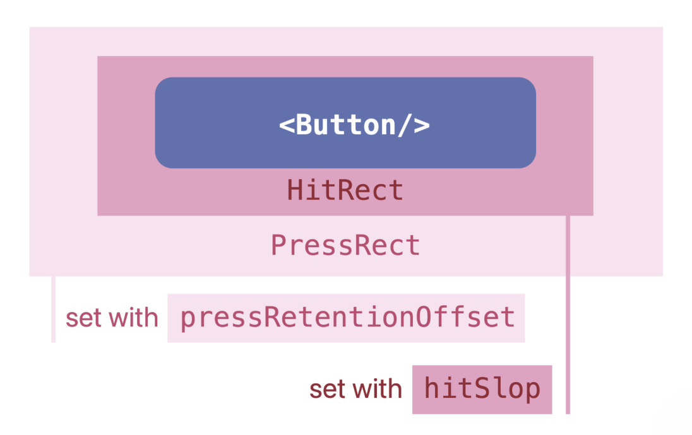

### 课程小结

以上就是我们这一讲的全部内容，现在我来给你总结一下今天这一讲的要点。如何实现一个体验好的点按组件呢？我建议你记住下面这三点：

1.   首先，一个好的点按组件应该让先让开发者用来很方便。React Native 的点按组件经历了三次迭代，每次迭代都在开发者体验（DX）上有所进步，我更推荐你使用第三代点按组件 Pressable。
2.   其次，一个好的点按组件应该要满足各种用户、各种场景的可扩展性。Pressable 组件支持四种基础点按事件，onPressIn、onPressOut、onPress、onLongPress。其中，点击事件 onPress 和长按事件 onLongPress 是互斥的，触发了一个就不会再触发另一个了。
3.   最后，一个优秀的工程师应该要“懂”用户，要把自己负责的 App、页面的用户体验（UX）提上去。任何的物理按钮都是有点击反馈的，我们的虚拟按钮也得有，这是最基本体验要求。然后，要让用户想点能点得到，要理解盒模型区域、可触发区域 HitRect、可保留区域 PressRect 的区别，并且进行合理设置。

## 07｜TextInput：如何实现一个体验好的输入框？

上一讲，我们介绍了如何去打磨点按组件的体验细节，这一讲我们就开始介绍如何打磨一个文本输入组件 TextInput 的体验细节。

作为一个优秀工程师，要想优化页面的用户体验，只知道打磨点按组件是远远不够的，而且，相对于点按组件组件来说，要把文本输入组件 TextInput 的细节体验弄好，要更难一些。这个难点主要有两方面。

1.   首先，TextInput 组件是自带状态的宿主组件。TextInput 输入框中的文字状态、光标状态、焦点状态在 React Native 的 JavaScript 框架层的框架层有一份，在 Native 的还有一份，有时候业务代码中还有一份。那多份状态到底以谁为主呢？这件事我们得搞清楚。
2.   其次，TextInput 组件和键盘是联动的，在处理好 TextInput 组件的同时，我们还得关心一下键盘。当然键盘本身是有 Keyboard API 的，但是键盘类型是“普通键盘”还是“纯数字键盘”，或者键盘右下角的按钮文字是“确定”还是“搜索”，都是由 TextInput 组件控制的。

这一讲，我将以如何实现一个体验好的输入框为线索，和你介绍使用 TextInput 组件应该知道的三件事。

### 输入框的文字

第一件事，你得知道如何处理输入框的文字。

关于如何处理输入框的文字，网上有两种说法。有些人倾向于使用非受控组件来处理，他们认为“不应该使用 useState 去控制 TextInput 的文字状态”，因为 ref 方案更加简单；有些人倾向于使用受控组件来处理，这些人认为“直接使用 ref 去操作宿主组件这太黑科技了”。这两种说法是相互矛盾的，究竟哪种是正确的呢？

我们先从最简单的**非受控（Uncontrolled）组件**说起。

非受控的意思就是不使用 state，直接对从宿主组件上将文本的值同步到 JavaScript。一个非受控的 UncontrolledTextInput 组件示例如下：

```jsx
const UncontrolledTextInput = () => <TextInput /> 
```

只要这一行代码，用户就可以输入文字了。在 UncontrolledTextInput 组件中， TextInput 元素是不受 state 控制，但在 JavaScript 代码中却并不知道用户输入的是什么，因此还要一个变量来存储用户输入的值。

用什么变量呢？首先在组件中声明局部变量是不行的，我们知道 render 就是组件函数的执行，每次执行局部变量也会重新赋值，局部变量保存的值不能跨越两次 render。其次，用全局变量或文件作用域的变量也是不行的，组件销毁时这些全局变量是不会销毁的，有内存泄露的风险。再者，用 state 也是不行的，用了 state 就成了受控组件了。

对于非受控组件来说，存储跨域两次 render 的可行方案是 ref。**ref 的值不会因为组件刷新而重新声明，它是专门用来存储组件级别的信息的**。React 官方推荐有三种场景我们可以用它：

-   存储 setTimeout/setInterval 的 ID；
-   存储和操作宿主组件（在 Web 中是 DOM 元素）；
-   存储其他不会参与 JSX 计算的对象。

我们使用 ref 保存非受控输入框的值，就属于第三种场景，示例代码如下：

```jsx
function UncontrolledTextInput2() {
  const textRef = React.useRef('');
  return <TextInput onChangeText={text => textRef.current = text}/>
}
```

你看，首先我们使用 `useRef` 创建了一个用于保存用户输入的文字的对象 `textRef`。每当用户输入文字的时候，会触发 `TextInput` 的`onChangeText`事件，在该事件的回调中，我们将最新的text赋值给了`textRef.current`进行保存。这时，每次获取文字就都是最新的文字了。

非受控组件的原理是最简单的，用户输入的“文本原件”是存在宿主组件上的，JavaScript 中的只是用`textRef`复制了一份 “文本的副本”而已。

但正是因为非受控组件使用的是副本，一些复杂的操作是做不了的，比如将用户输入的字母由大写强制改为小写，等等。在新架构 Fabric 之前，React Native 还提供了直接修改宿主组件属性的`setNativeProps`方法，但是 Fabric 之后（包括 Fabric 预览版），`setNativeProps` 就不能用了。

因此我们要操作文本原件，必须得用**受控（Controlled）组件**。

受控的意思说的是使用 JavaScript 中的 state 去控制宿主组件中的值。一个受控的 ControlledTextInput 组件示例如下：

```jsx
function ControlledTextInput() {
  const [text, setText] = React.useState('');
  return  <TextInput value={text} onChangeText={setText} />
}
```

在这个示例中，我们先使用了 `useState` 创建了一个状态 text 和状态更新函数`setText`，并将状态text赋值给了 `TextInput` 的属性 value，value 是控制 `TextInput` 宿主组件展示的值用的。在用户输入文字后，会触发 `onChangeText` 事件，这时就会调用 setText，将状态 text 更新为用户最新输入的值。

那受控组件和非受控组件有什么区别呢？我把它们之间的实现原理画了一张图：

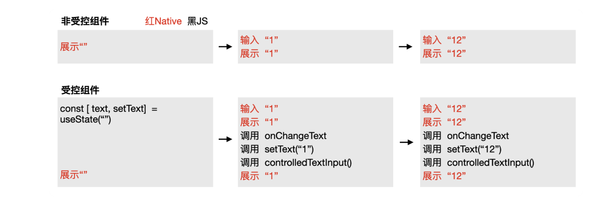

你看，对于非受控组件来说，用户输入文字和文字展示到屏幕的过程，全部都是在宿主应用层面进行的，JavaScript 业务代码是没有参与的。

然而，对于受控组件来说，用户输入文字和文字展示这两步，依旧是在宿主应用层面进行的。但后续 JavaScript 业务代码也参与进去了，业务代码依次执行了 onChangeText 函数、setText 函数、controlledTextInput 函数，并且再次更新了展示值。

也就是说，受控组件更新了两次展示的值，只是因为两次展示的值是一样的，用户看不出来而已。对于受控组件而言，即便存在系统或 Native 修改文本的情况，在 TextInput 的底层，也会将其强制更新为当前 TextInput 的 value 属性值。所以对于受控组件来说，输入框的文字始终是由 state 驱动的。

更新两次的好处在于，可以更加自由地控制输入的文本，比如语音输入文字、通过地图定位填写详细地址。这些复杂场景下，用户既可以自由输入文字，也可以引入程序参与进来。而非受控组件只适用于用户自由输入的场景。

不过，你可能会对更新两次有性能上的担忧。我也写了两个极限情况下的 demo，模拟了文字改变事件中需要处理 1s 任务，并且分别试了 onChangeText 的异步更新，和新架构提供的 unstable_onChangeSync 同步更新：

```jsx
<TextInput
  onChangeText={text => {
    const time = Date.now();
    while (Date.now() - time <= 1000) {}
    setText(text);
  }}
/>
<TextInput
  unstable_onChangeSync={event => {
    const text = event.nativeEvent.text;
    const time = Date.now();
    while (Date.now() - time <= 1000) {}
    setText(text);
  }}
/>
```

异步更新情况下，JavaScript 线程和 UI 主线程是独立运行的，此时即便 JavaScript 线程卡了 1s，主线程依旧可以正常输入文字。但同步更新的情况下，从输入文字到展示文字会有 1s 的延迟， JavaScript 线程有 1s 的阻塞，UI 主线程也会卡死 1s。

当然，大多数情况下处理文字改变事件肯定用不了 1s，甚至用不了 1ms。模拟极限情况，只是为了说明新架构的同步和异步是可选的，如果你担心性能问题，用异步就好了。

现在如果要我给个处理输入框的文本建议，那我的建议就是**使用受控组件，并且使用异步的文字改变事件**，这也符合大部分人的代码习惯。

### 输入框的焦点

你需要关注的第二件事是，如何控制输入框的焦点。通常光标放置在哪个输入框上，那个输入框就是页面的唯一焦点。

-   有些场景下，输入框的焦点是程序自动控制的，无需开发者处理。比如用户点击手机屏幕上的输入框，此时焦点和光标都会移到输入框上。
-   有些场景下，是需要代码介入控制焦点的。比如你购物搜索商品，从首页跳到搜索页时，搜索页的焦点就是用代码控制的。或者你在填写收货地址时，为了让你少点几次输入框，当你按下键盘的下一项按钮时，焦点就会从当前输入框自动转移到下一个输入框。

我们先来看怎么实现自动“对焦”，以搜索页的搜索输入框自动对焦为例，示例代码如下：

```jsx
<TextInput autoFocus/>
```

TextInput 的 autoFocus 属性，就是用于控制自动对焦用的，其默认值是 false。也就是说，所有的 TextInput 元素默认都不会自动的对焦，而我们将 TextInput 的 autoFocus 属性设置为 true 时，框架会在 TextInput 元素挂载后，自动帮我们进行对焦。

搜索页面只有一个搜索框的场景下 ，autoFocus 是好用的。但当一个页面有多个输入框时，autoFocus 就没法实现焦点的转移了。

比如，在购物 App 中填写收货地址时，你每完成一项填写，点击键盘中的下一项按钮，焦点就会自动转移一次，从姓名到电话再到地址。我们以前讲过，React/React Native 是声明式的，但是在操作自带状态的宿主属性时，比如焦点转移，声明式就不管用了，还得用给宿主组件下命令。

那怎么下命令呢？我们先从最简单的控制 TextInput 焦点讲起，示例代码如下：

```jsx
function AutoNextFocusTextInputs() {
  const ref1 = React.useRef<TextInput>(null);

  useEffect(()=>{
    ref1.current?.focus()
  },[])

  return  (
    <TextInput ref={ref1}  />
    )
}
```

在这段代码中，先声明了一个 `ref1` 用于保存 `TextInput` 宿主组件。在该宿主组件上封装了 Native/C++ 层暴露给 JavaScript 的命令，比如对焦`focus()`、失焦`blur()`、控制选中文字的光标`setSelection`。

`AutoNextFocusTextInputs`组件在挂载完成后，程序会调用`ref1.current.focus()`，将焦点对到 `TextInput` 元素上，这就是使用`focus()`实现对焦的原理。

使用` focus()`命令对焦和使用`autoFocus`属性对焦，在原生应用层面的实现原理是一样的，只不过在 JavaScript 层面，前者是命令式的，后者是声明式的。对自带状态的宿主组件而言，命令式的方法能够进行更复杂的操作。

那要实现每点一次键盘的“下一项”按钮，将焦点对到下一个 TextInput 元素上，怎么实现呢？具体的示例代码如下：

```jsx
function AutoNextFocusTextInputs() {
  const ref1 = React.useRef<TextInput>(null);
  const ref2 = React.useRef<TextInput>(null);
  const ref3 = React.useRef<TextInput>(null);

  return (
    <>
      <TextInput ref={ref1} onSubmitEditing={ref2.current?.focus} /> // 姓名输入框
      <TextInput ref={ref2} onSubmitEditing={ref3.current?.focus} /> // 电话输入框
      <TextInput ref={ref3} /> // 地址输入框
    </>
  );
}
```

首先，我们得声明 3 个 ref 用于保存 3 个 TextInput 元素。其次，实现这三个元素，它们依次是姓名输入框、电话输入框、地址输入框。最后，需要监听点击键盘完成按钮的提交事件`onSubmitEditing`，在`onSubmitEditing`的回调中，将焦点通过`ref.focus()`转移到下一个 `TextInput` 元素上。

这里再多说一句，为了简单起见，我们把三个 TextInput 元素都封装到了同一个组件中。在真实的项目中，这三个输入框往往不是封装成同一个组件中的，姓名输入框、电话输入框、地址输入框每个都是一个独立的组件，然后再有一个大的复合组件将它们组合在一起的。

那么这时，如何获取到 TextInput 元素 ref 呢？如果你遇到了这个问题，你可以查一下React 文档中，关于使用 React.forwardRef转发 ref的具体用法，这里我就不展开了。

### 联动键盘的体验

你需要关注的第三件事是，输入键盘的体验细节。

我们前面提到过，输入框和键盘是联动的，键盘的很多属性都可以用 TextInput 组件来设置。因此，除了输入框的值、输入框的焦点，我们还需要关心如何控制键盘。我们一起来看看那些优秀的 App 都是怎么处理这个细节的。

先来看第一个体验细节，iOS 微信搜索框的键盘右下角按钮有一个“**置灰置蓝**”的功能。默认情况下，键盘右下角的按钮显示的是置灰的“搜索”二字，当你在搜索框输入文字后，置灰的“搜索”按钮会变成蓝色背景的“搜索”二字。

置灰的作用是提示用户，没有输入文字不能进行搜索，按钮变蓝提示的是有内容了，可以搜索了。

控制键盘右下角按钮置灰置蓝的，是 TextInput 的`enablesReturnKeyAutomatically`属性，这个属性是 iOS 独有的属性，默认是`false`，也就是任何使用键盘右下角的按钮，都可以点击。你也可以通过将其设置为 `true`，使其在输入框中没有文字时置灰。

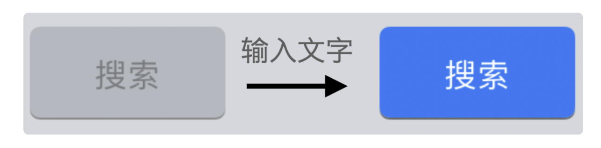

第二个体验细节是，键盘右下角按钮的文案是可以变化的，你可以根据不同的业务场景进行设置。

有两个属性可以设置这些文案，包括 iOS/Android 通用的 returnKeyType 和 Android 独有的 returnKeyLabel。全部的属性你可以查一下文档，我这里只说一下通用属性：

-   `default`：显示的文案是换行；
-   `done`：显示的文案是“完成”，它适合作为最后一个输入框的提示文案；
-   `go`：显示的文案是“前往”，它适合作为浏览器网站输入框或页面跳出的提示文案；
-   `next`：显示的文案是“下一项”，它适合作为转移焦点的提示文案；
-   `search`：显示的文案是“搜索”，它适合作为搜索框的提示文案；
-   `send`：显示的文案是“发送”，它比较适合聊天输入框的提示文案。

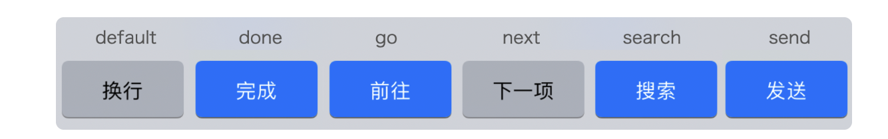

比如，在用户填写收货地址表单的场景中，你可以在用户完成填写时，将键盘按钮文案设置成“下一项”，并在用户点击“下一项”时，把当前输入框的焦点聚焦到一下个输入框上。

第三个体验细节是，登录页面的自动填写账号密码功能。虽然现在有了二维码登录，但传统的账号密码登录场景还是非常多的。每次登录的时候，要输入一遍账号密码，就很麻烦了。

无论是 iOS 还是 Android，它们都有系统层面的记住账号密码的功能，帮助用户快速完成账号密码的填写。完成快速填写功能的 TextInput 属性，在 iOS 上叫做textContentType，在 Android 上叫做autoComplete。

你可以将账号输入框的快速填写属性设置为username，将密码输入框的快速填写属性设置为password，帮助用户节约一些时间，提高一下整体的成功率。除此之外，一些姓名、电话、地址信息也可以快速填写。

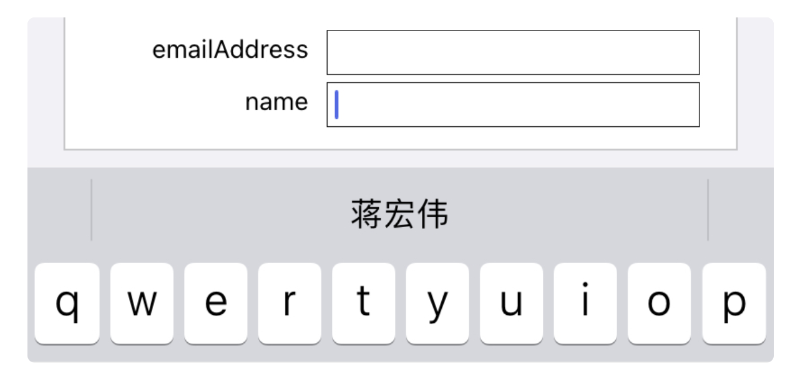

还有一些键盘的体验细节，比如keyboardType可以控制键盘类型，可以让用户更方便地输入电话号码phone-pad、邮箱地址email-address等等。

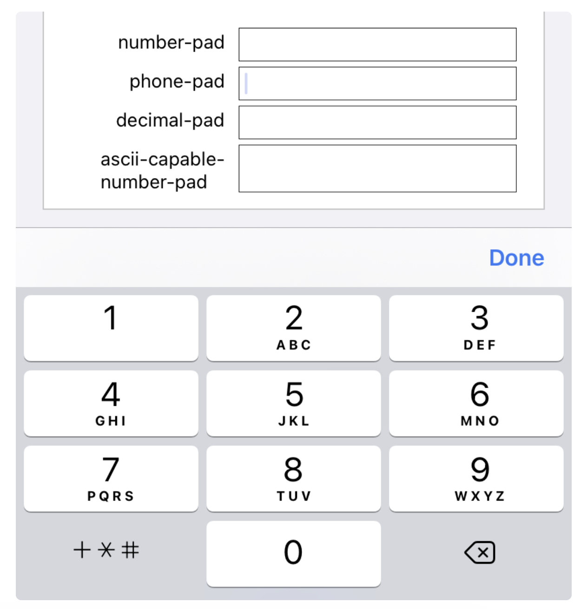

当你知道这些键盘细节后，你就可以利用这些系统的特性，帮你的 App 体验变得更好。现在，我们回过头，再来改善一下，我们之前实现的自动聚焦组件 `AutoNextFocusTextInputs`吧。示例代码如下：

```jsx
function AutoNextFocusTextInputs() {
  const ref1,ref2,ref3 ...

  return (
    <>
      <TextInput ref={ref1} placeholder="姓名" textContentType="name" returnKeyType="next" onSubmitEditing={ref2.current?.focus}/>
      <TextInput ref={ref2} placeholder="电话"  keyboardType="phone-pad" returnKeyType="done" onSubmitEditing={ref3.current?.focus}
      />
      <TextInput  ref={ref3}  placeholder="地址"  returnKeyType="done" />
    </>
  );
}
```

在这段代码中，我们使用了`placeholder`来提醒用户该输入框应该输入什么，使用了 `textContentType="name" `来辅助用户填写姓名，使用了` keyboardType="phone-pad" `来指定键盘只用于输入电话号码，使用`returnKeyType="next" `或` "done"`来提示用户当前操作的含义，当然还有`ref.current.focus()`的自动聚焦功能。

### 总结

这一讲，我们还是围绕着交互体验这个角度来讲组件，从交互体验这个角度看 TextInput 组件，我们需要注意三件事：

1.   学会处理输入框的文字。有两种处理方式受控组件和非受控组件，受控组件更强大一些，也更符合大多数 React/React Native 开发者的习惯；
2.   学会处理输入框的焦点。处理焦点有两种方式：一种是声明式的`autoFocus`属性，另一种是命令式的`ref.current.focus()`方法，前者适用场景有限，后者适用场景更多；
3.   学会处理与输入框联动的键盘，包括键盘右下角的按钮、键盘提示文案、键盘类型等等。

日常工作中，用到 TextInput 输入框的场景非常多，有聊天框、搜索框、信息表单等等，相信学完这一讲后，你能更好地处理 TextInput 体验细节。

## 08｜List：如何实现高性能的无限列表？

如果你熟悉 React Native ，那你可能会问了：“React Native 中的列表组件不是 FlatList 吗？”。

没错。React Native 官方提供的列表组件确实是 FlatList，但是我推荐你优先使用开源社区提供的列表组件 RecyclerListView。因为，开源社区提供的 RecyclerListView 性能更好。

对于列表组件来说，我们最应该关心的就是性能。这里我给你分享下我的个人经历。2016~2018 年，我参与了一个用 React Native 搭建的信息流项目。信息流这种无限列表页是非常常见的业务场景，比如你使用的京东首页、抖音视频、微信朋友圈都属于信息流页面。你看完一页，还有下一页，看完下一页还有下下页，无穷无尽。这时就要用到我们马上要探讨的列表组件了，而且必须是高性能的列表组件，不能翻着翻着就卡起来了。

2016 年，没有 RecyclerListView，也没有 FlatList，我们用的是第一版的 ListView 组件。ListView 组件性能很差，没有内存回收机制，翻一页内存就涨一点，再翻一页内存又再涨一点。前 5 页滚动非常流畅，第 10 页开始就感觉到卡顿了，到 50 页的时候，基本就滑不动了。卡顿的原因就是无限列表太吃内存了。如果手机的可使用内存不够了，卡顿就会发生。这也是 React Native 刚出来时被吐槽得最多的地方。

2017 年，官方的第二代列表组件 FlatList 出来后，第一代列表组件 ListView 就被废弃了，这时候无限列表性能变得好一些了。虽然 FlatList 在 iOS 端表现很好，但在 Android 低端机还是能感觉到卡顿。

2018 年，随着业务越来越复杂，FlatList 的性能表现变得更加糟糕了。经过调研，我们找到了性能更好的列表组件 RecyclerListView。通常评判列表卡顿的指标是 UI 线程的帧率和 JavaScript 线程的帧率。

但业内有人实验过，在已经渲染完成的页面中，通过死循环把 JavaScript 线程卡死，页面依旧能够滚动。这是因为滚动本身是在 UI 线程进行的，和 JavaScript 线程无关。但当用户下滑，需要渲染新的列表项时，就需要 JavaScript 线程参与进来了。如果这时候 JavaScript 掉帧了，新的列表项就渲染不出来，即便能滚动，用户看到也是空白项，一样影响用户体验。

因此，我们当时是把 JavaScript 帧率作为客观指标，再加上团队同学主观体验，进行综合评估。采集 JavaScript 帧率用的手机是 OPPO R9，现在看来是妥妥的低端机了，结果显示，FlatList JavaScript 帧率小于 20 帧的占比有 16%，而 RecyclerListView 占比只有 3%。主观体验上，团队同学拿自己的手机进行测试，使用暴力滑动的测试方法，测评了 20 来款机型。在低端机上 FlatList 多被标记为一般卡，而 RecyclerListView 大多标记是流畅，只有少量的轻微卡顿。

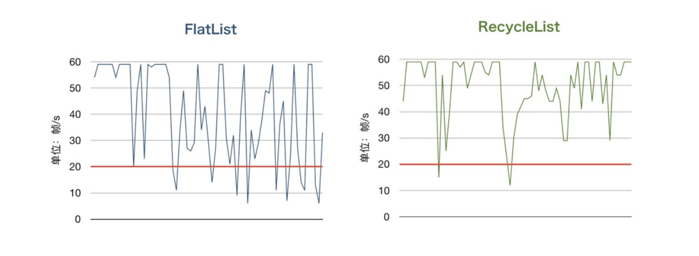

即使现在新架构马上要出来了，在这个时间点上，我最推荐你用的还是 RecyclerListView。因为从原理上 RecyclerListView 比 FlatList 强上不少。

作为一个开发者，你总有需要手动优化的时候，不是所有场景都有现成的组件，都有自动化的解决方案。如果你现在没有遇到，兴许只是因为开发年头太少了，你可以问问你身边那些开发年头多的同学，他们在这方面应该是有很深的体会。学习 FlatList、RecyclerListView 的优化原理，对自己的动手优化是非常有帮助的。当你以后遇到列表性能问题时，你可以有现成的优化思路借鉴，不会毫无头绪。

那么，为什么开源社区的 RecyclerListView 比官方的 FlatList 性能更好？FlatList、RecyclerListView 的优化原理是什么？FlatList 和 RecyclerListView 的底层实现都是滚动组件 ScrollView，所以我们先从 ScrollView 聊起。

### ScrollView：渲染所有内容的滚动组件

ScrollView 是一个支持横向或竖向的滚动组件，几乎所有页面都会用到。

ScrollView 组件类似于 Web 中的 或 标签，浏览器中的页面之所以能上下滚动，就是因为 `<html/>` 或 `<body/>` 标签默认有一个 overflow-y: scroll 的属性，如果你把标签的属性设置为 overflow-y: hidden，页面就不能滚动了。

React Native 的 ScrollView 组件在 Android 的底层实现用的是 ScrollView 和 HorizontalScrollView，在 iOS 的底层实现用的是 UIScrollView。

所谓的滚动，解决的是在有限高度的屏幕内浏览无限高度的内容的问题。有限高度的容器是 ScrollView，无限高度，或者说高度不确定的内容是 ScrollView 的 children。

使用 ScrollView 组件时，我们通常并不直接给 ScrollView 设置固定高度或宽度，而是给其父组件设置固定高度或宽度。

一般而言，我们会使用安全区域组件 SafeAreaView 组件作为 ScrollView 的父组件，并给 SafeAreaView 组件设置布局属性 flex:1，让内容自动撑高 SafeAreaView。使用 SafeAreaView 作为最外层组件的好处是，它可以帮我们适配 iPhone 的刘海屏，节约我们的适配成本，示例代码如下：

```jsx
<SafeAreaView style={{flex: 1}}>
  <ScrollView>
    <Text>1</Text>
  <ScrollView/>
</SafeAreaView>    
```

了解完 ScrollView 组件的基本使用方法后，我们再来看下 ScrollView 的性能，看看如果使用 ScrollView 来实现无限列表会怎么样。

你可以看看下面这段代码：

```jsx
// 10 个 item 就能填满整个屏幕，渲染很快
// 1000 个 item 相当于 100+ 个屏幕的高度，渲染很慢
const NUM_ITEMS = 1000; 

const makeContent = (nItems: number, styles: any) => {
  return Array(nItems)
    .fill(1)
    .map((_, i) => (
      <Pressable
        key={i}
        style={styles}>
        <Text>{'Item ' + i}</Text>
      </Pressable>
    ));
};

const App = () => {
  return (
    <SafeAreaView style={{flex: 1}}>
      <ScrollView>{makeContent(NUM_ITEMS, styles.itemWrapper)}</ScrollView>
    </SafeAreaView>
  );
};
```

上面这段代码，说的就是使用 ScrollView 组件一次性直接渲染 1000 个子视图，这里没有做任何懒加载优化。

以信息流业务为例，用户进入页面后第一眼看到的只有屏幕中的信息，一般不超过 10 条。一次性渲染 10 条信息，其实很快，就是一眨眼的功夫。但如果是 1000 条呢？算力乘以 100，内存乘以 100，耗时也乘以 100，渲染速度就慢下来了。大量的计算和内存浪费在了用户看不到的地方。

使用 ScrollView 组件时，ScrollView 的所有内容都会在首次刷新时进行渲染。内容很少的情况下当然无所谓，内容多起来了，速度也就慢下来了。那有什么优化方案吗？

你肯定想到了一些优化方案，比如按需渲染。

我参加过一个使用 React Native 开发的、类似抖音的视频流页面，用的就是按需渲染。用户始终只会看到当前屏幕显示的视频、下一个视频和上一个视频，我们只需要用 ScrollView 渲染 3 个视频就能满足用户的所有操作。这样做，无论用户怎么翻页，内存中就只有 3 个视频，当然也不会卡了。

刚刚说的视频流按需加载，做起来是相对容易一些的，因为只用控制 3 个视频就可以了。但类似微信朋友圈、京东首页这种一屏有多条信息内容的复杂列表页，手动按需加载就麻烦很多。那有没有“自动"的按需加载方案呢？有。

### FlatList：按需渲染的列表组件

FlatList 列表组件就是 “自动”按需渲染的。

FlatList 是 React Native 官方提供的第二代列表组件。FlatList 组件底层使用的是虚拟列表 VirtualizedList，VirtualizedList 底层组件使用的是 ScrollView 组件。因此 VirtualizedList 和 ScrollView 组件中的大部分属性，FlatList 组件也可以使用。关于 FlatList 更具体的使用方法，你可以查看官方文档。现在，我们还是回到 FlatList 的原理，先从理论层面上理解 FlatList 为什么可以自动按需渲染。

我们要知道，列表组件和滚动组件的关键区别是，列表组件把其内部子组件看做由一个个列表项组成的集合，每一个列表项都可以单独渲染或者卸载。而滚动组件是把其内部子组件看做一个整体，只能整体渲染。而自动按需渲染的前提就是每个列表项可以独立渲染或卸载。

简单地讲，FlatList 性能比 ScrollView 好的原因是， FlatList 列表组件利用按需渲染机制减少了首次渲染的视图，利用空视图的占位机制回收了原有视图的内存，你可以对比一下二者的区别：

```jsx
// 从上到下滚动时的渲染方式
// SrcollView 渲染方式：一次渲染所有视图
SrcollView0_9  = [{👁},{ },{ },{ }]  // 浏览0~9条列表项
SrcollView10_19 = [{ },{👁},{ },{ }] // 浏览10~19条列表项
SrcollView20_29 = [{ },{ },{👁},{ }] // 浏览20~29条列表项
SrcollView30_39 = [{ },{ },{ },{👁}] // 浏览30~39条列表项

// FlatList 渲染方式：按需渲染，看不见的地方用 $empty 占位
FlatList0_9  = [{👁},{ }]               // 浏览0~9条列表项
FlatList10_19 = [{ },{👁},{ }]          // 浏览10~19条列表项
FlatList20_29 = [$empty,{},{👁},{}]     // 浏览20~29条列表项
FlatList30_39 = [$empty,$empty,{ },{👁}]// 浏览30~39条列表项
```

在上面的示例中，同样是渲染 40 条列表。ScrollView 一次性渲染了 40 条列表，无论你滚动到哪儿，所有的列表项都是渲染好的。

但 FlatList 在你浏览 0~9 条列表项时，只渲染了 0~19 条列表，剩余的 20~39 条列表项是没有渲染的。在你浏览滚动到第 10~19 条时，FlatList 把 20~29 条列表项提前加载出来了，这就是按需渲染加载机制. 当你继续滚动到 20~29 条列表项时，FlatList 会把第 0~9 条列表项回收，用空元素 $empty 代替，当你再滚动到 30~39 条列表项时，同理 10~19 条列表项也会被空元素 $empty，这就是内存回收。

40 条列表只是一个假设的例子，实现 FlatList 自动按需渲染的思路具体可以分为三步：

1.   通过滚动事件的回调参数，计算需要按需渲染的区域；
2.   通过需要按需渲染的区域，计算需要按需渲染的列表项索引；
3.   只渲染需要按需渲染列表项，不需要渲染的列表项用空视图代替。

第一步，计算按需渲染区域。具体地说，每次你滚动页面，都会触发滚动组件 ScrollView 组件的一个“异步”回调 onScroll 事件。

在 onScroll 事件中，我们可以获取到当前滚动的偏移量 offset 等信息。以当前滚动的偏移量为基础，默认向上数 10 个屏幕的高度，向下数 10 个屏幕的高度，这一共 21 个屏幕的内容就是需要按需渲染的区域，其他区域都是无需渲染的区域。这样，即便是异步渲染，我们也不能保证所有 JavaScript 执行的渲染任务都实时地交由 UI 线程处理，立刻展示出来。但因为有这 10 个屏幕的内容作为缓冲，用户无论是向上滚动还是向下滚动，都不至于一滚动就看到白屏。

现在我们知道了按需渲染的区域，接着要计算的就是按需渲染列表项的索引。FlatList 内部实现就是通过 setState 改变按需渲染区域第一个索引和最后一个索引的值，来实现按需渲染的 。

怎么计算按需渲染列表项的索引呢？接着我们继续看第二步。这里我们分两种情况，第一种是列表项的高度是确定的情况，另外一种是列表项的高度是不确定的情况。

1.   如果设计师给的列表项的高度是确定的，那么我们在写代码的时候，就可以通过获取列表项布局属性 getItemLayout 告诉 FlastList。在列表项高度确定，且知道按需渲染区域的情况下，“求按需渲染列表项的索引”就是一个简单的四则运算的问题，程序能够准确地计算出来。
2.   如果设计师给的 UI 稿中是不定高的列表项，也就是高度是由渲染内容决定的。你就没有办法在写代码的时候把列表项的高度告诉 FlastList 了，那么 FlastList 就要先把列表项渲染出来才能获取高度。对于高度未知的情况，FlastList 会启用列表项的布局回调函数 onLayout，在 onLayout 中会有大量的动态测量高度的计算，包括每个列表项的准确高度和整体的平均高度。

在这种列表项高度不确定，而且给定按需渲染区域的情况下，我们可以通过列表项的平均高度，把按需渲染列表项的索引大致估算出来了。即便有误差，比如预计按需渲染区域为上下 10 个屏幕，实际渲染时只有上下 7、8 个屏幕也是能接受的，大部分情况下用户是感知不到的屏幕外内容渲染的。

但是，实际生产中，如果你不填 getItemLayout 属性，不把列表项的高度提前告诉 FlastList，让 FlastList 通过 onLayout 的布局回调动态计算，用户是可以感觉到滑动变卡的。因此，如果你使用 FlastList，又提前知道列表项的高度，我建议你把 getItemLayout 属性填上。

第三步，渲染需要按需渲染列表项。有了索引后，渲染列表项就变得很简单，用 setState 即可。

假设 1 个屏幕高度的内容由 10 个列表项组成。在首次渲染的时候，按需渲染的列表项索引是 0~110，这时会渲染 11 个屏幕高度的内容。当用户滑到第 11 个屏幕时，索引就是 0~210，这时再在后面渲染 10 个屏幕高度的内容。当用户滑到第 21 个屏幕时，索引是 100~310，又会再在后面渲染 10 个屏幕高度的内容，同时把前面 10 个屏幕高的内容用空视图代替。当然这个过程是顺滑的，列表项是一个个渲染的，而不是 1 个屏幕或 10 个屏幕渲染的。

### RecyclerListView：可复用的列表组件

聊完 FlastList，我们再来看下 RecyclerListView。

RecyclerListView 是开源社区提供的列表组件，它的底层实现和 FlatList 一样也是 ScrollView，它也要求开发者必须将内容整体分割成一个个列表项。

在首次渲染时，RecyclerListView 只会渲染首屏内容和用户即将看到的内容，所以它的首次渲染速度很快。在滚动渲染时，只会渲染屏幕内的和屏幕附近 250 像素的内容，距离屏幕太远的内容是空的。

React Native 的 RecyclerListView 复用灵感来源于 Native 的可复用列表组件。

-   在 iOS 中，表单视图 UITableView，实际就是可以上下滚动、左右滚动的可复用列表组件。它可以通过复用唯一标识符 reuseIdentifier，标记表单中的复用单元 cell，实现单元 cell 的复用。
-   在 Android 上，动态列表 RecyclerView 在列表项视图滚出屏幕时，不会将其销毁，相反会把滚动到屏幕外的元素，复用到滚动到屏幕内的新的列表项上。这种复用方法可以显著提高性能，改善应用响应能力，并降低功耗。

如果你只开发过 Web，你可以这样理解复用：原来你要销毁一个浏览器中 DOM，再重新创建一个新的 DOM，现在你只改变了原有 DOM 的属性，并把原有的 DOM 挪到新的位置上。

RecyclerListView 的复用机制是这样的，你可以把列表比作数组 list，把列表项类比成数组的元素。用户移动 ScrollView 时，相当于往数组 list 后面 push 新的元素对象，而 RecyclerListView 相当于把 list 的第一项挪到了最后一项中。挪动对象位置用到的计算资源少，也不用在内存中开辟一个新的空间。而创建新的对象，占用计算资源多，同时占用新的内存空间。

简而言之，RecyclerListView 在滚动时复用了列表项，而不是创建新的列表项，因此性能好。

### 从使用方式看底层原理

接下来，我们从 RecyclerListView 使用方式的角度，进一步地剖析其底层原理。

RecyclerListView 有三个必填参数：

-   列表数据：dataProvider(dp)；
-   列表项的布局方法：layoutProvider；
-   列表项的渲染函数：rowRenderer。

先来看第一个必填参数**列表数据 dataProvider（dp）**。为了区分列表数据 dataProvider（第一个字母小写）和列表数据类 DataProvider（第一个字母大写），后面我会用缩写 dp 来代替列表数据，其使用方法如下：

```jsx
const listData = Array(300).fill(1).map( (_,i) => i)

const dp = new DataProvider((r1, r2) => {
   return r1 !== r2;
});

this.state = {
    dataProvider: dp.cloneWithRows(listData),
};

this.setState({
  dataProvider: dp.cloneWithRows(newListData),
})
```

在上面代码中，我们首先通过 Array(300) 创建了一个长度为 300 的数组 listData，其内容是 0~299 的数字，我们通过它来模拟 300 条信息数据。

接着，dp 是列表数据类 DataProvider new 出来的对象，它是一个存放 listData 的数据容器。它有一个必填参数，就是对比函数。在列表项复用时，对比函数会频繁地调用，因此我们只推荐对更新数据进行 r1 !== r2 的浅对比，不推荐深对比。

第三部分代码，是我们调用 dp.cloneWithRow 方法，该方法接收 listData 数组作为参数，这时我们正式把 listData 装到了 dp 容器中。其返回值 dataProvider，就是 React 的列表状态。

第四部分代码，是我们调用 setState 方法，该方法接收 dp.cloneWithRows() 的返回的 dp 对象作为参数，dp 列表数据对象更新了，整个列表也就更新了。

接下来是第二个必填参数，**列表项的布局方法 layoutProvider**。

```jsx
const _layoutProvider = new LayoutProvider(
  index => {
    if (index % 3 === 0) {
      return ViewTypes.FULL;
    } else {
      return ViewTypes.HALF_RIGHT;
    }
  },
  (type, dimension) => {
    switch (type) {
      case ViewTypes.HALF_RIGHT:
        dimension.width = width / 2;
        dimension.height = 160;
        break;
      case ViewTypes.FULL:
        dimension.width = width;
        dimension.height = 140;
        break;
    }
  },
);
```

layoutProvider 类初始化时，有两个函数入参。第一个入参函数是通过索引 index 获取类型 type，对应的是类型可枚举。第二个入参函数是通过类型 type 和布局尺寸 dimension 获取每个类型的宽高 width 和 height，对应的是确定宽高。

用起来很简单，但这两个入参为什么要这么设计，它们有什么用？

使用列表组件 RecyclerListView 有两个前提：首先是列表项的宽高必须是确定的，或者是大致确定的；第二是列表项的类型必须是可枚举的。这两个前提，都体现在了列表项的布局方法 layoutProvider 中了。

先来看第一个前提，宽高必须确定。RecyclerListView 用的是 position:absolute 的绝对定位布局，所有的列表项的宽度 width、高度 height、顶部偏移量 top、左边偏移量 left 都得在布局之前计算出来。

但实际上布局方法 layoutProvider，只需要知道列表项的宽（width）、高（height）就可以了，偏移量 top、left 可以根据宽高推算出来。比如，第 N 个列表项的偏移量 top 值，实际等于前面 N - 1 个列表项的高度之和。

如果宽高不确定呢？分两种情况，一种就是不确定的，另一种是不确定但可以转换为大致确定的。对于就是不确定的情况，RecyclerListView 是无解的；对于大致确定的情况，我们可以开启 forceNonDeterministicRendering 小幅修正布局位置。

比如，信息流的标题文字少的时候是一行布局，文字多的时候是两行布局，一行两行的高度偏差不大，可以在渲染后让框架帮忙进行小幅修正。通常在用户看到之前，这种小幅修正就已经完成了，用户感知不到列表的偏移。

但如果是信息流的内容高度不确定，相差百来个像素，这种大幅修正可能会让用户察觉到，不适合使用 RecyclerListView 。

再来看第二个前提，类型可枚举。可枚举很好理解，两个列表项的底层 UI 视图必须一样或者大致相似，才能只改列表数据复用列表视图。如果每个列表项的 JSX 结构完全不一样，就不存在复用的可能性。一般来说，一个类型对应一个自定义组件。

理解了确定宽高和类型可枚举两个前提后，你再来看布局方法 layoutProvider 需要的两个函数入参，就能清楚它的原因了。

最后是第三个必填参数，列表项的**渲染函数：rowRenderer**。

有了数据、布局，还得有组件进行承载。列表内容被分割成了一个个的列表项，每一个列表项展示都是独立的内容信息，而可枚举的列表项组件用于承载每条信息的载体。列表项的渲染函数 rowRenderer 的作用就是根据类型和数据，返回对应的自定义列表项组件。这块逻辑比较简单，我就不做过多讲解了。

rowRenderer 的对应代码，我也放在了这里，你可以对照查看：

```jsx
//Given type and data return the view component
  _rowRenderer(type, data) {
    //You can return any view here, CellContainer has no special significance
    switch (type) {
      case ViewTypes.HALF_RIGHT:
        return (
          <CellContainer style={styles.containerGridRight}>
            <Text>Data: {data}</Text>
          </CellContainer>
        );
      case ViewTypes.FULL:
        return (
          <CellContainer style={styles.container}>
            <Text>Data: {data}</Text>
          </CellContainer>
        );
      default:
        return null;
    }
  }
```

### PK：ScrollView、FlatList、RecyclerListView

到这里，我相信你已经对 ScrollView、FlatList 和 RecyclerListView 底层原理有了一定的了解。现在，我们再横向对比一下这三个组件，帮你加深理解。

从底层原理看：

-   ScrollView 内容的布局方式是从上到下依次排列的，你给多少内容，ScrollView 就会渲染多少内容；
-   FlatList 内容的布局方式还是从上到下依次排列的，它通过更新第一个和最后一个列表项的索引控制渲染区域，默认渲染当前屏幕和上下 10 屏幕高度的内容，其他地方用空白视图进行占位；
-   RecyclerListView 性能最好，你应该优先使用它，但使用它的前提是列表项类型可枚举且高度确定或大致确定。

理解了底层原理，FlatList 和 RecyclerListView 孰强孰弱，相信你已经有了答案。

内存上，FlatList 要管理 21 个屏幕高度的内容，而 RecyclerListView 只要管理大概 1 个多点屏幕高度的内容，RecyclerListView 使用的内存肯定少。计算量上，FlatList 要实时地销毁新建 Native 的 UI 视图，RecyclerListView 只是改变 UI 视图的内容和位置，RecyclerListView 在 UI 主线程计算量肯定少。

你也可以自己实际的体验、看看性能指标或者 Debug 一下，来佐证你的结论。

理解了底层原理，ScrollView、FlatList 和 RecyclerListView 使用场景，估计你也能基本把握住了：

-   ScrollView 适合内容少的页面，只有几个屏幕高页面是适合的；
-   FlatList 性能还过得去，但我不推荐你优先使用它，只有在你的列表项内容高度不能事先确定，或者不可枚举的情况下使用它；
-   RecyclerListView 性能最好，你应该优先使用它，但使用它的前提是可枚举且高度确定或大致确定。

这里我也总结成了两张图表，你可以看看：

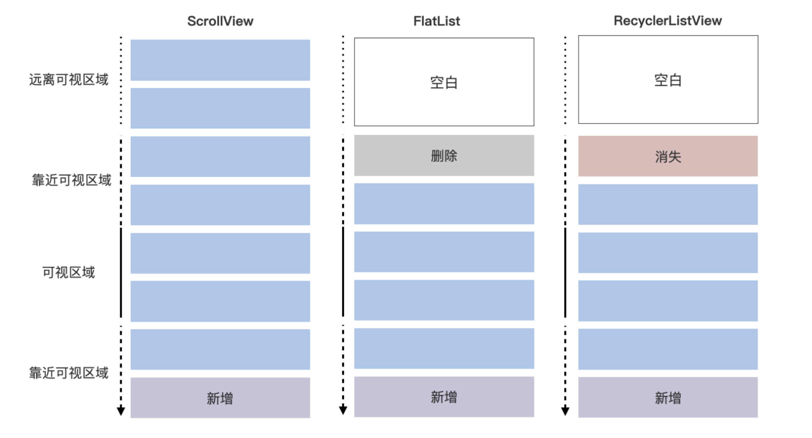

 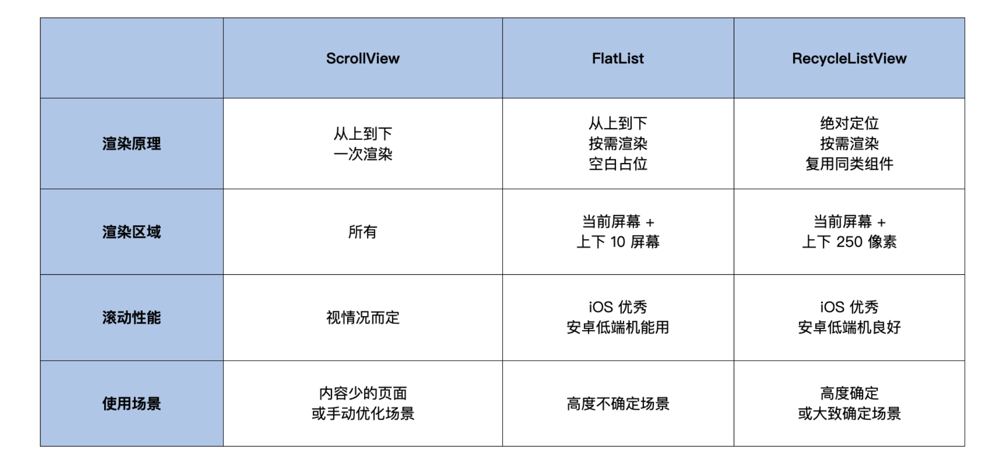

### 总结

最后，我们总结一下今天这节课所讲的重点：

1.   滚动组件 ScrollView 是列表组件 FlastList 和 RecyclerListView 的底层实现，ScrollView 的绝大部分属性在 FlastList 和 RecyclerListView 上都有；
2.   从按需渲染的可视区域的大小和对底层 UI 视图的操作方式上分析，RecyclerListView 比 FlastList 的内存更少，在 UI 线程的计算量也更少；
3.   为了让你的无限列表性能更好，我推荐你优先使用 RecyclerListView，然后才是 FlastList。

列表是一个很大的话题，牵涉到的性能优化细节和实践内容很多，这一讲可以算作列表的一个入门。

受限于手机性能，无限列表是经常出现性能问题的重灾区，我也参与和优化过一些非常复杂的无限列表场景，包括 Hybrid、小程序 和 React Native，有过非常多的实践。在后面的篇章中，我会基于这些入门知识，和你讲讲具体业务中的实践操作，还有一些新架构中无限列表的变化。


